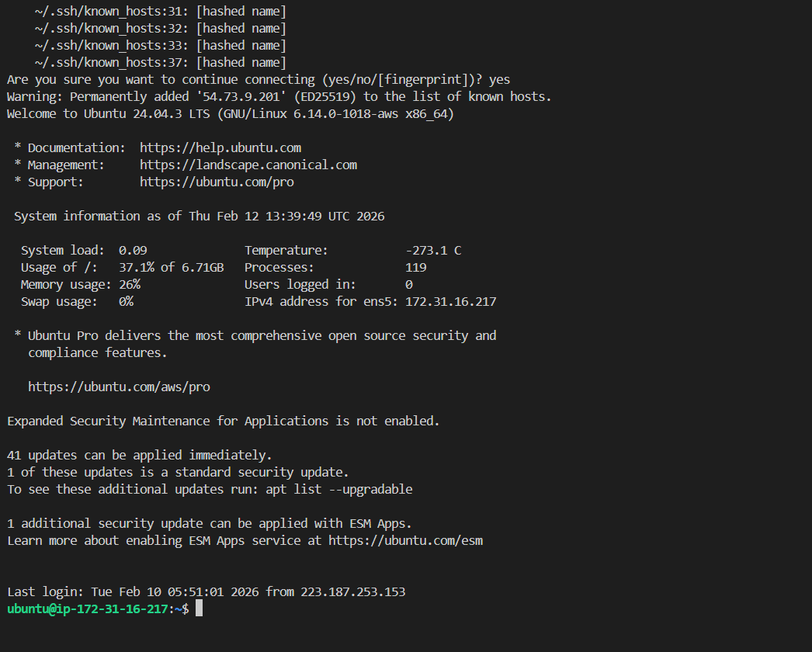
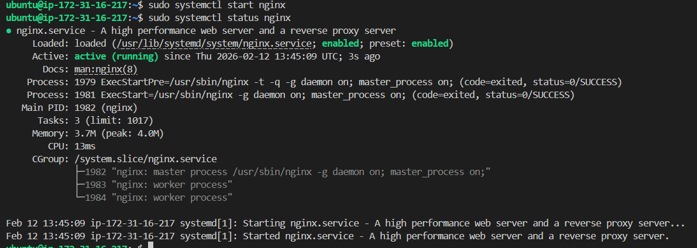
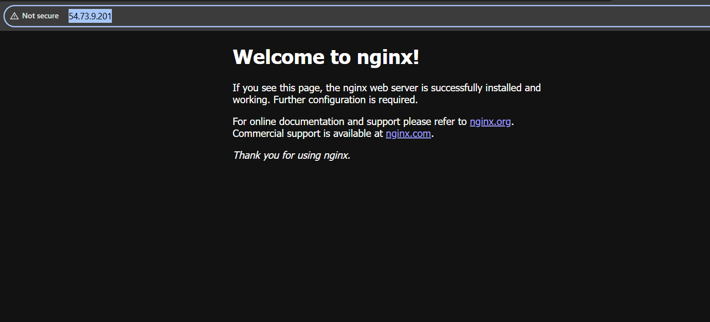
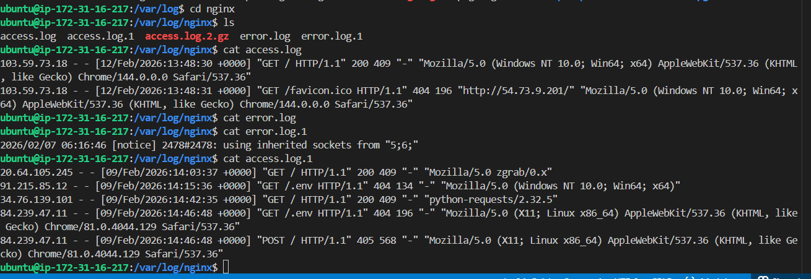

# Part 1

**Connect via SSH**

# Part 2
**Install Docker & Nginx**

 

 

# Part 3: Security Group Configuration

**Test Web Access:**
Open browser and visit: `http://54.73.9.201:80`

# Part 4: Extract Nginx Logs

## Commands Used
- ssh -i practice-key.pem ubuntu@54.73.9.201
- sudo apt update
- sudo apt-get install docker.io
- sudo apt install nginx
- cd /var/log/nginx
- cat access.log.1>log.txt
- scp -i practice-key.pem ubuntu@54.73.9.201:/home/ubuntu/scripts/log.txt /mnt/s/TWS/90DaysOfDevOps/2026/Linux/day-08
log.txt           

## Challenges Faced
- when copying logs from /var/log/nginx folder faced permission denied even after using sudo .
hence copied to /home/ubuntu/scripts and resolved.
- had little trouble downloading file to local .

## What I Learned
- learned how to install docker nginx
- learned about nginx web server
- learned how to access logs
- learned how to download logs to local