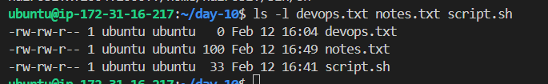
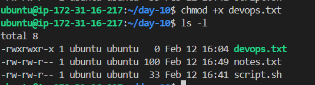

# Day 10 Challenge

## Files Created

## Permission Changes

## Commands Used
- touch devops.txt
- echo "Hello trainwith shubham.com , have a happy learning">notes.txt
- vim script.sh
- cat /etc/passwd | head -2
- cat /etc/passwd | tail -2

## What I Learned
- file permission 
- file creation
- retrieving data using head, tail