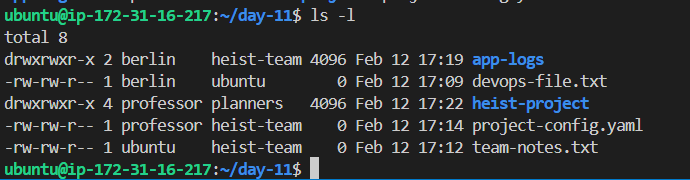
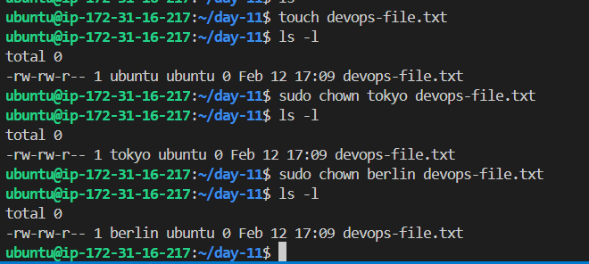
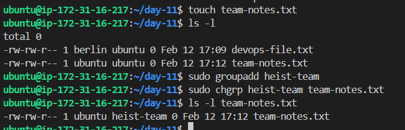
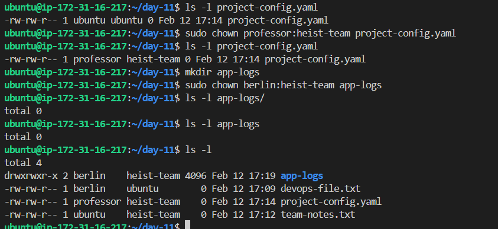
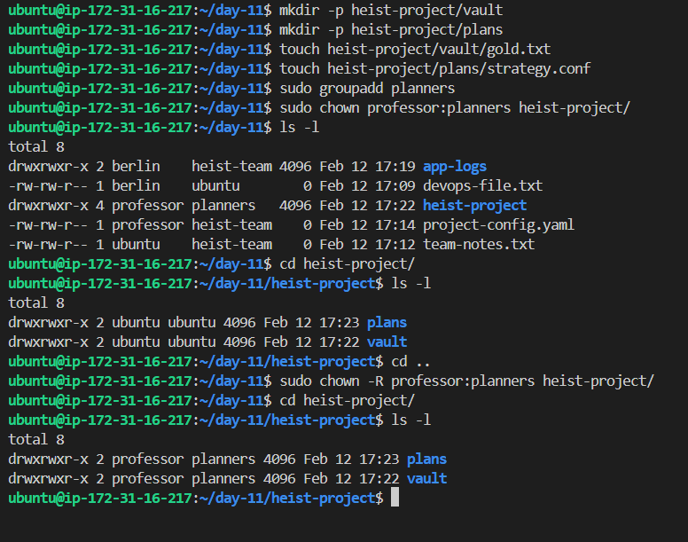

# Day 11 Challenge

## Files & Directories Created

## Ownership Changes

-  

- 

- 

- 

- 

## Commands Used
- touch devops-file.txt
- sudo chown berlin devops-file.txt
- sudo chgrp heist-team team-notes.txt
- sudo chown professor:planners heist-project/
- sudo chown -R professor:planners heist-project/

## What I Learned
`how recursive flag works`
`how we change owner and group in a single command`

