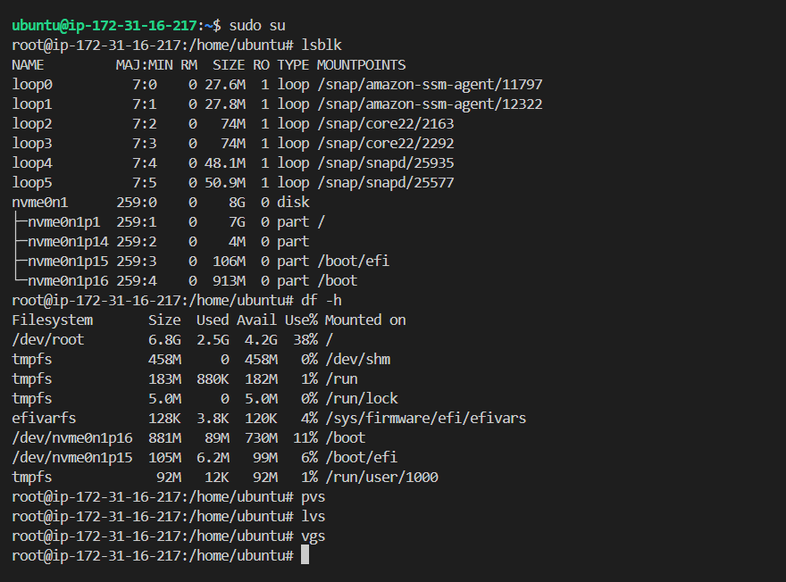
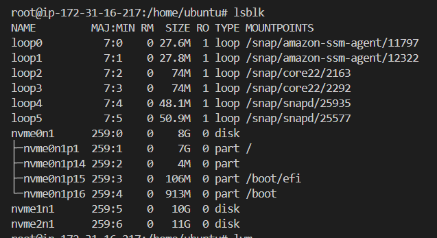
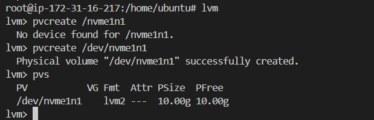
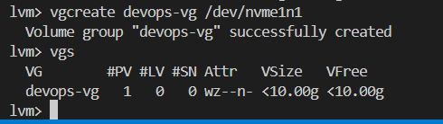
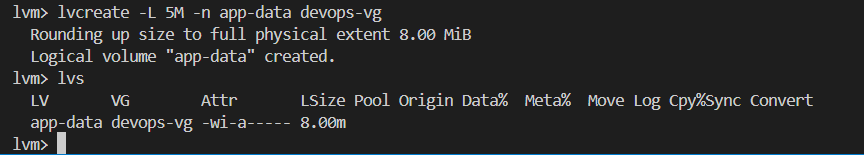
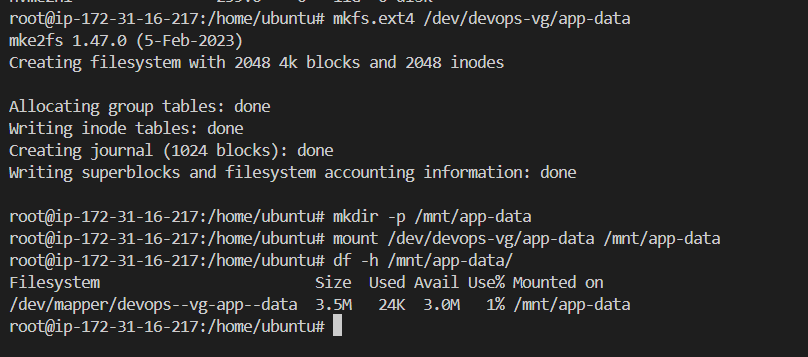

# Day 13 – Linux Volume Management (LVM)

### Task 1: Check Current Storage
Run: `lsblk`, `pvs`, `vgs`, `lvs`, `df -h`



**attached 10G and 11G volume from EBS**




### Task 2: Create Physical Volume
```bash
pvcreate /dev/sdb   # or your loop device
pvs
```



### Task 3: Create Volume Group
```bash
vgcreate devops-vg /dev/sdb
vgs
```



### Task 4: Create Logical Volume
```bash
lvcreate -L 500M -n app-data devops-vg
lvs
```



### Task 5: Format and Mount
```bash
mkfs.ext4 /dev/devops-vg/app-data
mkdir -p /mnt/app-data
mount /dev/devops-vg/app-data /mnt/app-data
df -h /mnt/app-data
```


