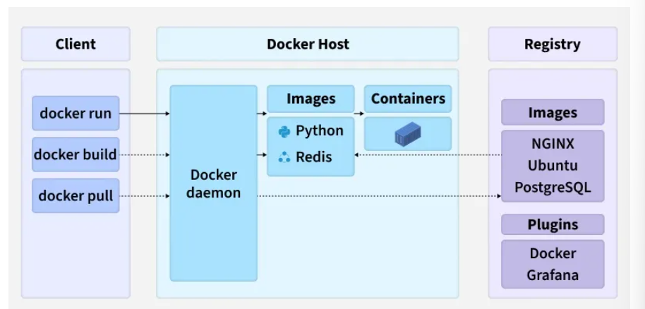
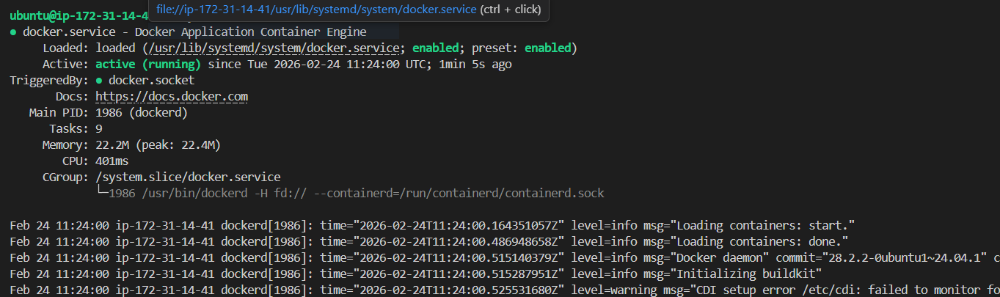
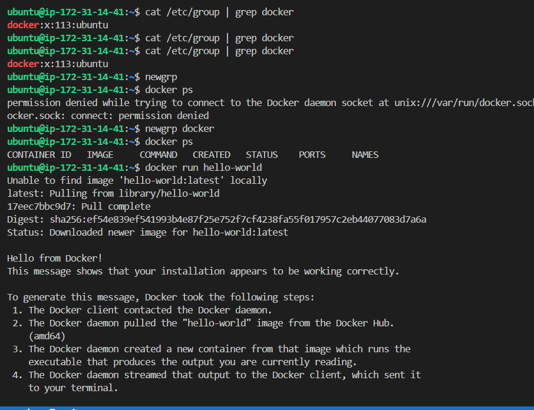
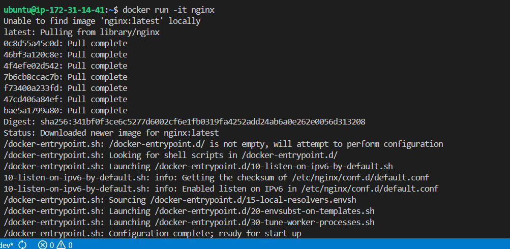
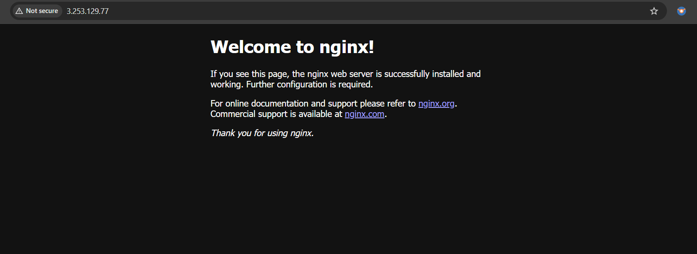
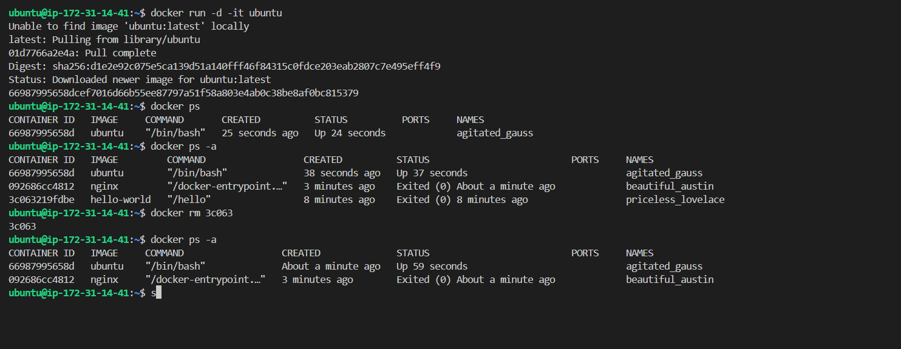
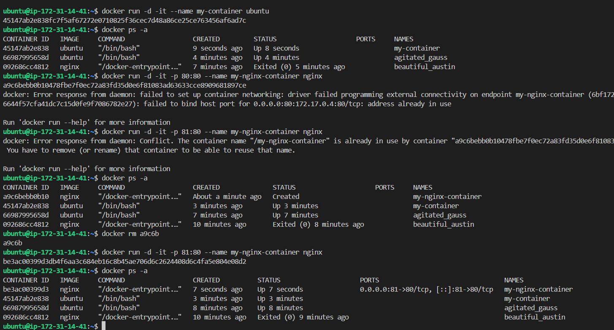
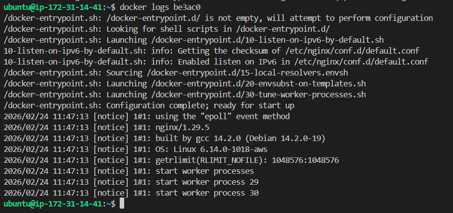
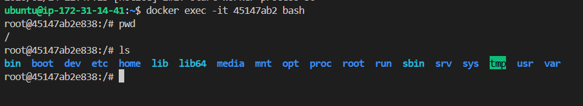

## Challenge Tasks

### Task 1: What is Docker?
- What is a container and why do we need them?
`ans : Containers are lightweight, portable units that package an application and its dependencies.`

- Containers vs Virtual Machines — what's the real difference?
`ans: Containers run on top of Host OS and are lightweight whereas VMs carry their own OS Image hence Heavyweight`

- What is the Docker architecture? (daemon, client, images, containers, registry)
`ans: Docker follows cl;ient-server architecture.`
The Model consist of :
1. Docker client - The Docker Client is the interface for users. When a user execute commands like `docker run`, `docker build` the client sends the request to docker daemon.
2. Docker Host - This is where Docker Daemon runs and provides environment to execute and run containers.
3. Docker Registry - This is remote repository for storing and downloading docker images.

---

### Task 2: Install Docker
1. Install Docker on your machine (or use a cloud instance)
2. Verify the installation
3. Run the `hello-world` container
4. Read the output carefully — it explains what just happened

---

### Task 3: Run Real Containers
1. Run an **Nginx** container and access it in your browser
2. Run an **Ubuntu** container in interactive mode — explore it like a mini Linux machine
3. List all running containers
4. List all containers (including stopped ones)
5. Stop and remove a container

**sample output**

---

### Task 4: Explore
1. Run a container in **detached mode** — what's different? `ans: when running a container in detached mode using -d flag, it run in background `
2. Give a container a custom **name** `ans : docker run -d -it --name my-container ubuntu`
3. Map a **port** from the container to your host. ` ans : docker run -d -it -p 80:80 --name my-nginx-container nginx `
4. Check **logs** of a running container `ans : docker logs <container_id>`
5. Run a command **inside** a running container ` ans : docker exec -it <container_id> bash`

**sample output**

---
