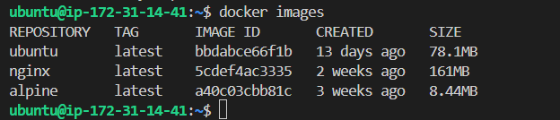
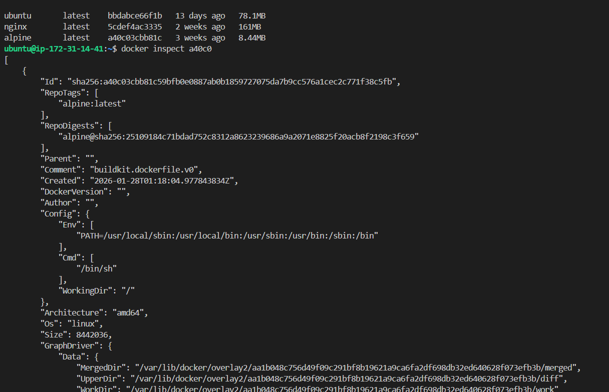
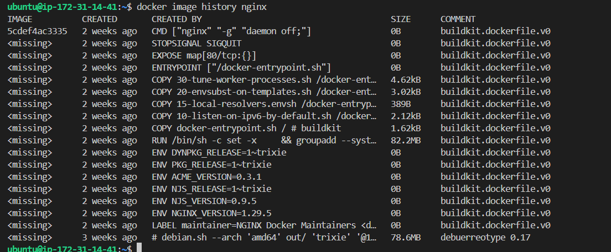
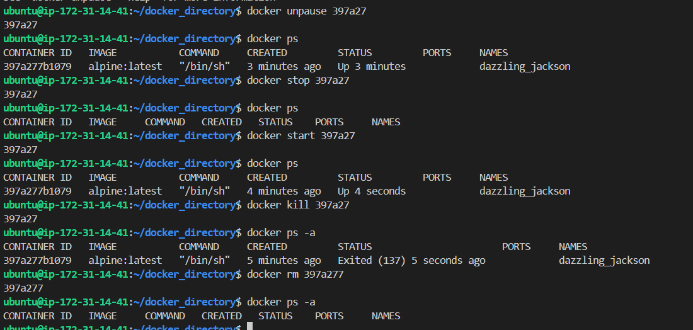
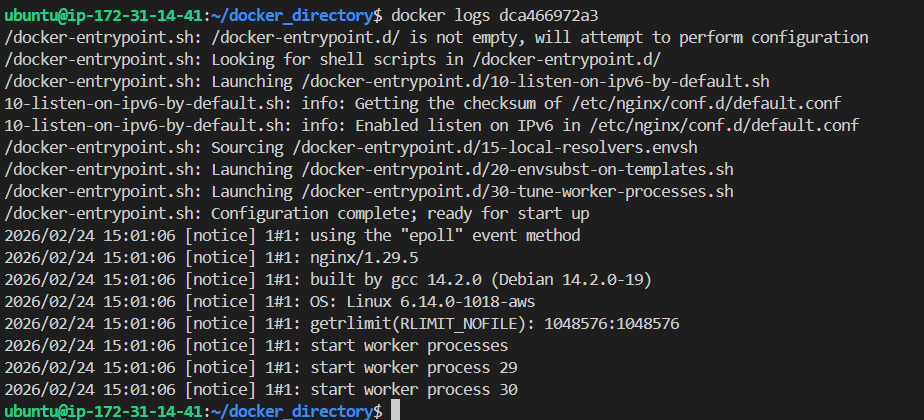
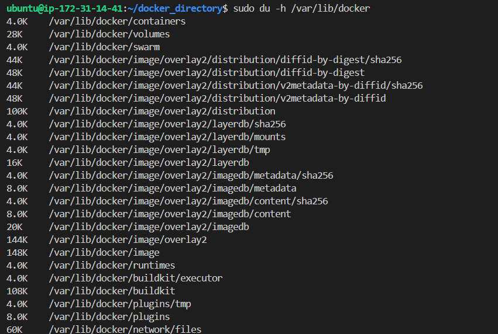

## Challenge Tasks

### Task 1: Docker Images
1. Pull the `nginx`, `ubuntu`, and `alpine` images from Docker Hub ` ans : **docker pull ubuntu** **docker pull nginx** **docker pull alpine**`
2. List all images on your machine — note the sizes

3. Compare `ubuntu` vs `alpine` — why is one much smaller?
`ans : Ubuntu is standard image with pre-installed tools and provides complete Linux environment inside container whereas alpine is super minimal Linux distribution for speed and security`

4. Inspect an image — what information can you see? `ans : image created date, shell used, architecture, OS, size , RepoTags`

5. Remove an image you no longer need
`docker rmi <image_id>`

---

### Task 2: Image Layers
1. Run `docker image history nginx` — what do you see? 
2. Each line is a **layer**. Note how some layers show sizes and some show 0B
3. Write in your notes: What are layers and why does Docker use them?
`ans : Each layer in an image contains a set of filesystem changes - additions, deletions, or modifications. Docker uses them because it allows layers to be reused between images.`

---

### Task 3: Container Lifecycle
Practice the full lifecycle on one container:
1. **Create** a container (without starting it) `docker run -d -it alpine:latest`
2. **Start** the container `docker start <container id>`
3. **Pause** it and check status `docker pause <container_id>`
4. **Unpause** it `docker unpause <container_id>`
5. **Stop** it `docker stop <container_id>`
6. **Restart** it `docker start <container_id>`
7. **Kill** it `docker kill <container_id>`
8. **Remove** it `docker rm <container_id>`

**Check `docker ps -a` after each step — observe the state changes**

---

### Task 4: Working with Running Containers
1. Run an Nginx container in detached mode `docker run -d -it -p 81:80 nginx:latest`
2. View its **logs** `docker logs <container_id>`

3. View **real-time logs** (follow mode) `docker logs -f <container_id>`
4. **Exec** into the container and look around the filesystem
5. Run a single command inside the container without entering it
6. **Inspect** the container — find its `IP address- 172.17.0.2 , port mappings- 80/TCP, and mounts- `

---

### Task 5: Cleanup
1. Stop all running containers in one command `docker stop $(docker ps -aq)`
2. Remove all stopped containers in one command `docker rm $(docker ps -aq)`
3. Remove unused images `docker rmi $(docker images -aq)`
4. Check how much disk space Docker is using `du -h /var/lib/docker`

---