## Challenge Tasks

### Task 1: The Problem
1. Run a Postgres or MySQL container 
- ans : `docker pull mysql `, `docker run -d -e MYSQL_ROOT_PASSWORD=root mysql:latest`, `docker exec -it 0dc35be bash`,`mysql -u root -p`
2. Create some data inside it (a table, a few rows — anything)
-  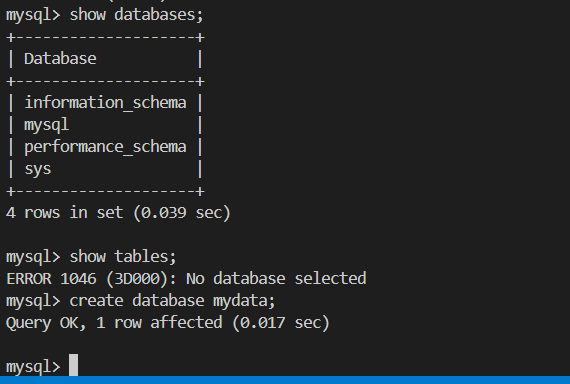

3. Stop and remove the container
- 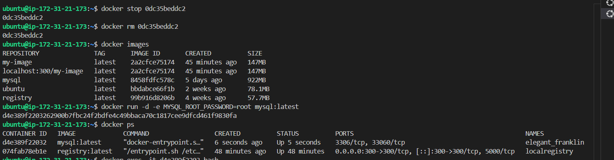

4. Run a new one — is your data still there?
- 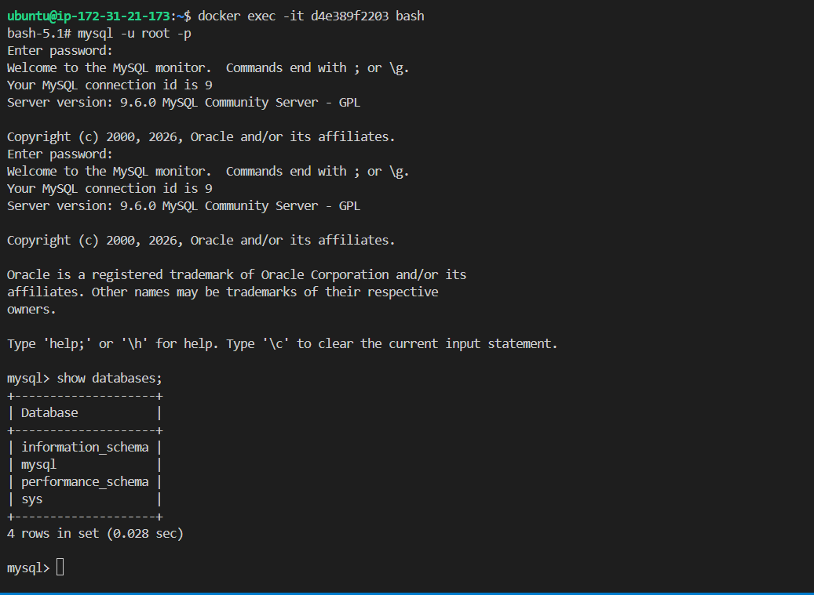

Write what happened and why.
`ans: after I removed and ran a new container my database is lost because container doesn't persist data after removed/deleted`
---

### Task 2: Named Volumes
1. Create a named volume ` docker volume create mysql_data`
2. Run the same database container, but this time **attach the volume** to it `docker run -d -e MYSQL_ROOT_PASSWORD=root -v mysql_data:/var/lib/mysql mysql:latest`
3. Add some data, stop and remove the container 
- 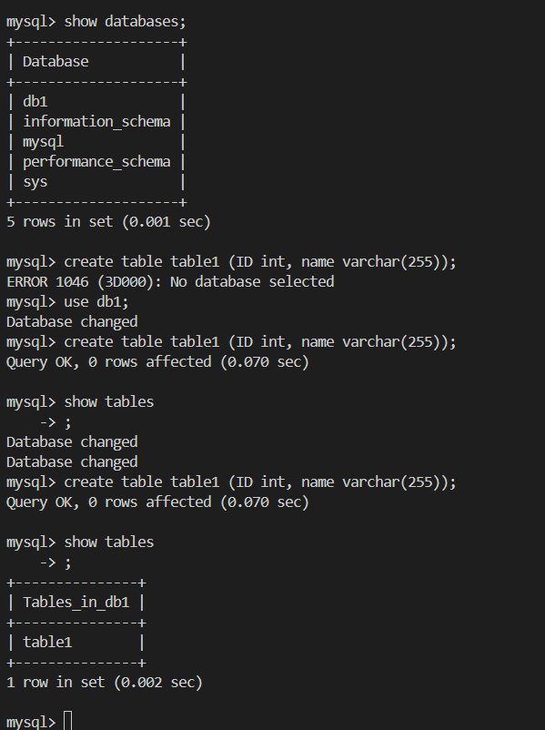
  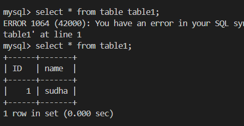

4. Run a brand new container with the **same volume**
-  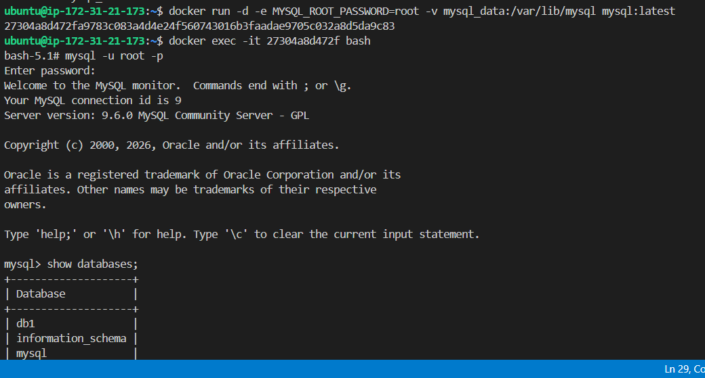

5. Is the data still there?
- yes data is still there

**Verify:** `docker volume ls`, `docker volume inspect`
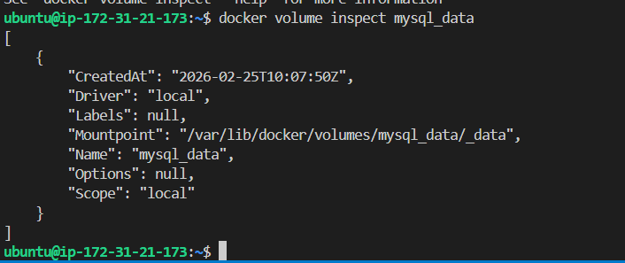

---

### Task 3: Bind Mounts
1. Create a folder on your host machine with an `index.html` file
2. Run an Nginx container and **bind mount** your folder to the Nginx web directory
3. Access the page in your browser
4. Edit the `index.html` on your host — refresh the browser

Write in your notes: What is the difference between a named volume and a bind mount?

---

### Task 4: Docker Networking Basics
1. List all Docker networks on your machine `docker network ls`
2. Inspect the default `bridge` network ` docker network inspect bridge`
3. Run two containers on the default bridge — can they ping each other by **name**? NO
4. Run two containers on the default bridge — can they ping each other by **IP**? yes

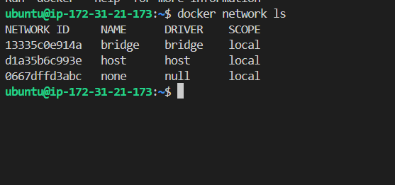
---

### Task 5: Custom Networks
1. Create a custom bridge network called `my-app-net`
2. Run two containers on `my-app-net`
3. Can they ping each other by **name** now?
4. Write in your notes: Why does custom networking allow name-based communication but the default bridge doesn't?

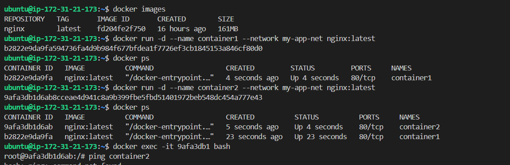
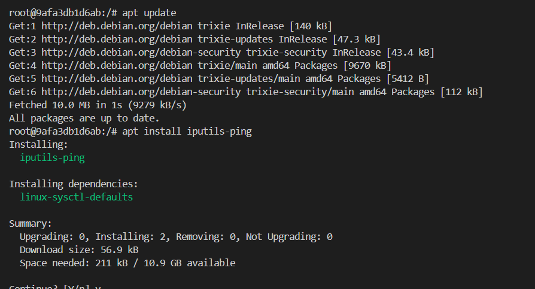
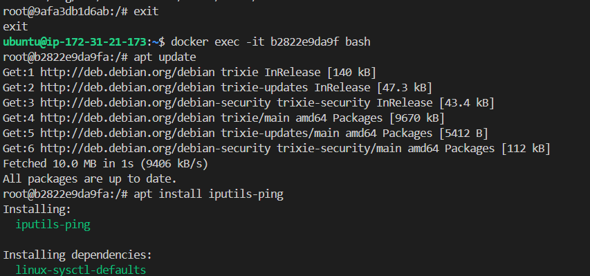
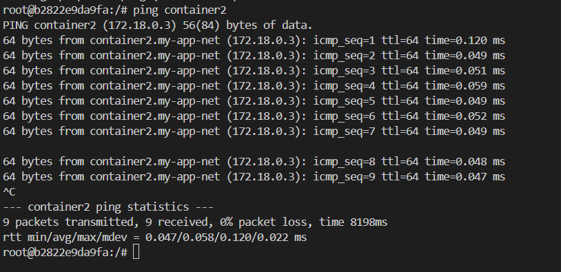

---

### Task 6: Put It Together
1. Create a custom network
2. Run a **database container** (MySQL/Postgres) on that network with a volume for data
3. Run an **app container** (use any image) on the same network
4. Verify the app container can reach the database by container name

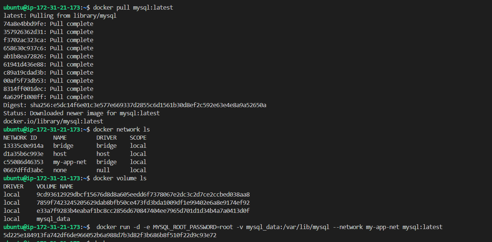
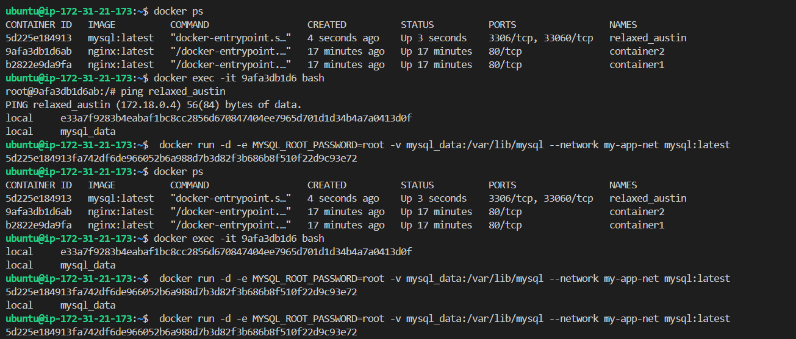
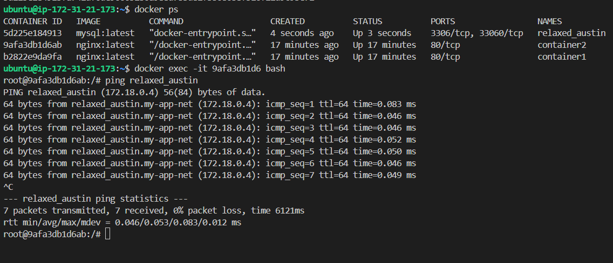
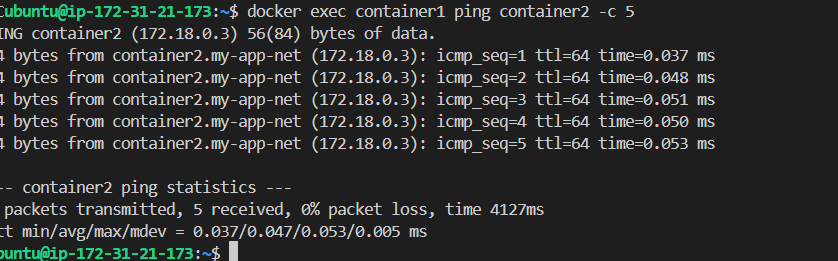
---

## Hints
- Volumes: `docker volume create`, `-v volume_name:/path`
- Bind mount: `-v /host/path:/container/path`
- Networking: `docker network create`, `--network`
- Ping: `docker exec container1 ping container2`

---
