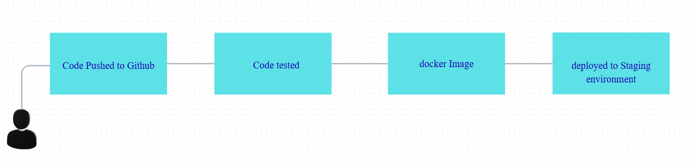

## Challenge Tasks

### Task 1: The Problem
Think about a team of 5 developers all pushing code to the same repo manually deploying to production.

Write in your notes:
1. What can go wrong? `ans: manually deploying can lead to error prone code to production and lot of time, and all pushing code to same repo can lead to conflict`

2. What does "it works on my machine" mean and why is it a real problem?`It means application and its required configurations, dependencies are compatible with my machine hence working. It is a real problem because it creates instability and issues.`

3. How many times a day can a team safely deploy manually? `ans: In general it is not best practice to manually deploy ina day, rather in real-time manual deployments happens in quarter`

---

### Task 2: CI vs CD
Research and write short definitions (2-3 lines each):
1. **Continuous Integration** — what happens, how often, what it catches `ans: It is a devops practice in which developer integrate their code changes into a shared repository.Through regular integrations these changes are automatically verified by running tests. CI process can be done multiple times in a day. It catches early bugs, issues, code quality problem.`

2. **Continuous Delivery** — how it's different from CI, what "delivery" means `ans: Continuous delivery delivers code changes to environment but requires a manual intervention like approval before deploying to production. Example-Etsy`

3. **Continuous Deployment** — how it differs from Delivery, when teams use it `ans: Continuous deployment incorporates CI but goes further by automatically deploying all the code changes to a environment after the build stage. It doesn't include manual intervention for deployment. Example-Netflix`

---

### Task 3: Pipeline Anatomy
A pipeline has these parts — write what each one does:
- **Trigger** — what starts the pipeline
- **Stage** — a logical phase (build, test, deploy)
- **Job** — a unit of work inside a stage
- **Step** — a single command or action inside a job
- **Runner** — the machine that executes the job
- **Artifact** — output produced by a job

---

### Task 4: Draw a Pipeline
Draw a CI/CD pipeline for this scenario:
> A developer pushes code to GitHub. The app is tested, built into a Docker image, and deployed to a staging server.

Include at least 3 stages. Hand-drawn and photographed is perfectly fine.

---

### Task 5: Explore in the Wild
1. Open any popular open-source repo on GitHub (Kubernetes, React, FastAPI — pick one you know)
2. Find their `.github/workflows/` folder
3. Open one workflow YAML file
4. Write in your notes:
   - What triggers it? `
   - How many jobs does it have?
   - What does it do? (best guess)

---
