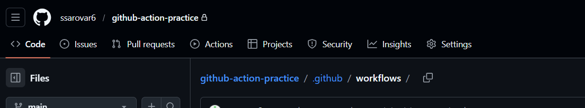
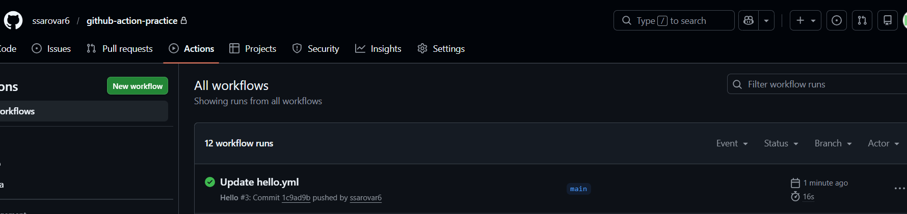
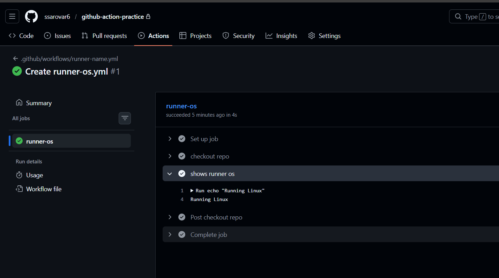
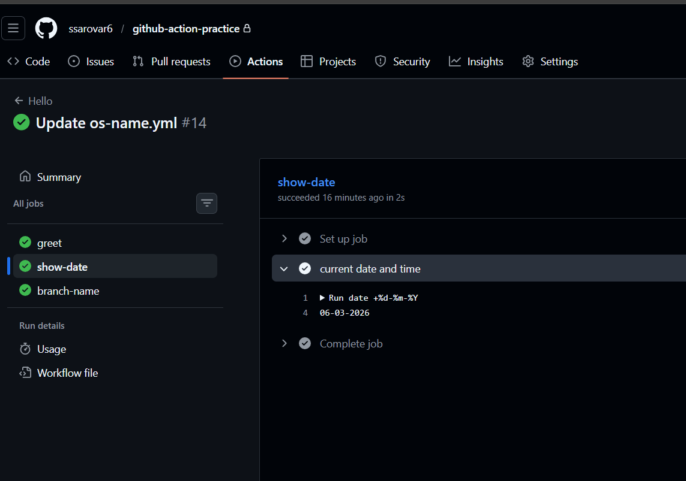

## Challenge Tasks

### Task 1: Set Up
1. Create a new **public** GitHub repository called `github-actions-practice`
2. Clone it locally
3. Create the folder structure: `.github/workflows/`

---

### Task 2: Hello Workflow
Create `.github/workflows/hello.yml` with a workflow that:
1. Triggers on every `push`
2. Has one job called `greet`
3. Runs on `ubuntu-latest`
4. Has two steps:
   - Step 1: Check out the code using `actions/checkout`
   - Step 2: Print `Hello from GitHub Actions!`

Push it. Go to the **Actions** tab on GitHub and watch it run.

**Verify:** Is it green? Click into the job and read every step.

---

### Task 3: Understand the Anatomy
Look at your workflow file and write in your notes what each key does:
- `on:` = the **on** key defines when the workflow should run
- `jobs:` = the **jobs** define structure of the workflow and contains steps
- `runs-on:` = the **runs-on** key define which runner will execute the job
- `steps:` = the **steps** key define individual task and commands that is used in jobs.
- `uses:` = the **uses** key is used to select an action that is already defined/pre-defined and can be reused.
- `run:` = the **run** key define the actual command or action that the job will execute
- `name:` (on a step) = it defines sequence of a task

---

### Task 4: Add More Steps
Update `hello.yml` to also:
1. Print the current date and time
2. Print the name of the branch that triggered the run (hint: GitHub provides this as a variable)
3. List the files in the repo
4. Print the runner's operating system

Push again — watch the new run.

---

### Task 5: Break It On Purpose
1. Add a step that runs a command that will **fail** (e.g., `exit 1` or a misspelled command)
2. Push and observe what happens in the Actions tab
3. Fix it and push again

Write in your notes: What does a failed pipeline look like? How do you read the error?

---