# Challenge Tasks

### Task 1: GitHub-Hosted Runners
1. Create a workflow with 3 jobs, each on a different OS:
   - `ubuntu-latest`
   - `windows-latest`
   - `macos-latest`
2. In each job, print:
   - The OS name
   - The runner's hostname
   - The current user running the job
3. Watch all 3 run in parallel

Write in your notes: What is a GitHub-hosted runner? Who manages it? `ans : Github-hosted Runners are machines that run the job and are managed by Microsoft`

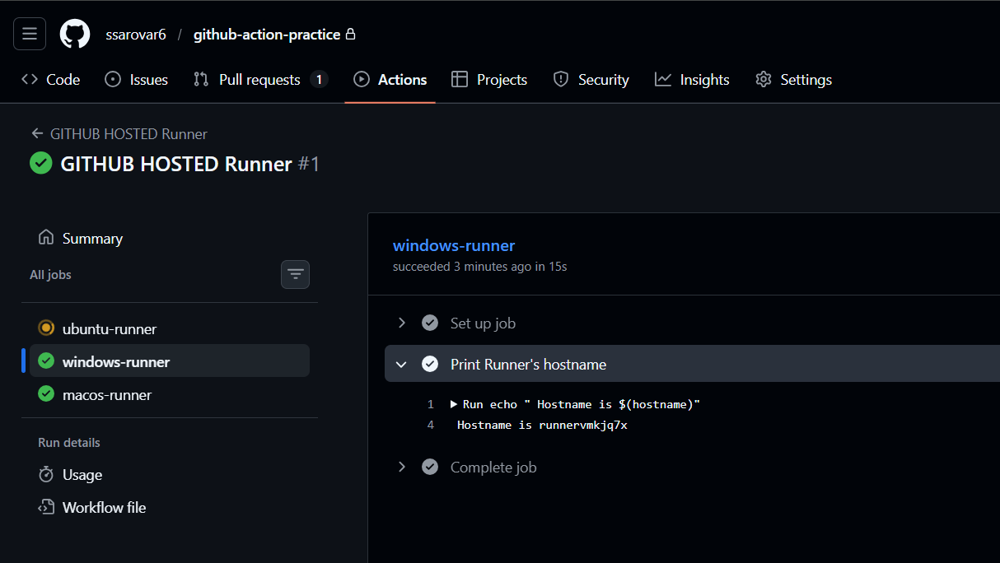
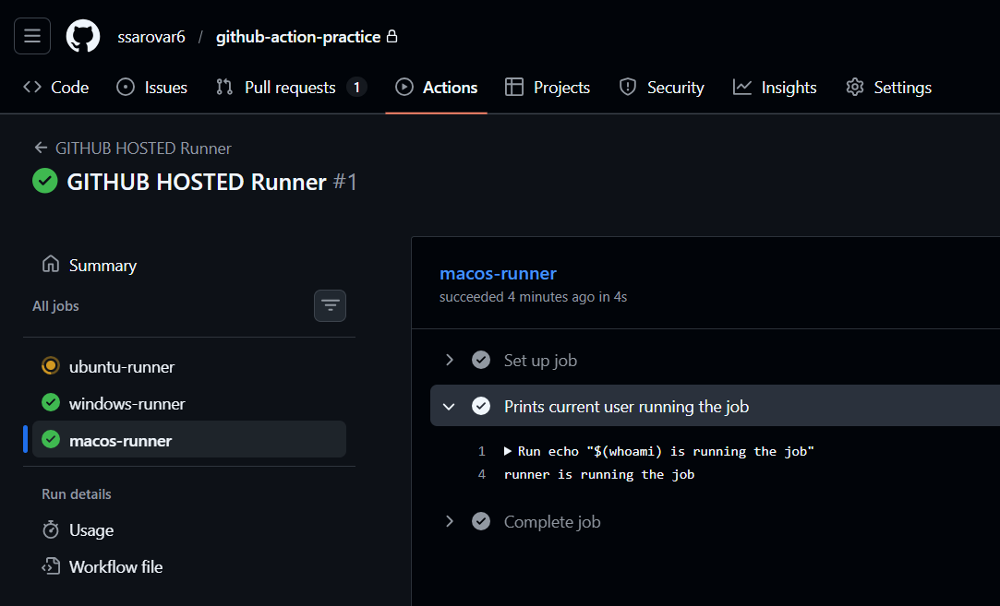
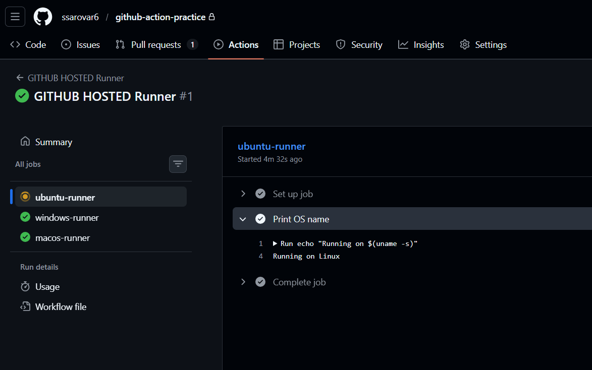

---

### Task 2: Explore What's Pre-installed
1. On the `ubuntu-latest` runner, run a step that prints:
   - Docker version
   - Python version
   - Node version
   - Git version
2. Look up the GitHub docs for the full list of pre-installed software on `ubuntu-latest`

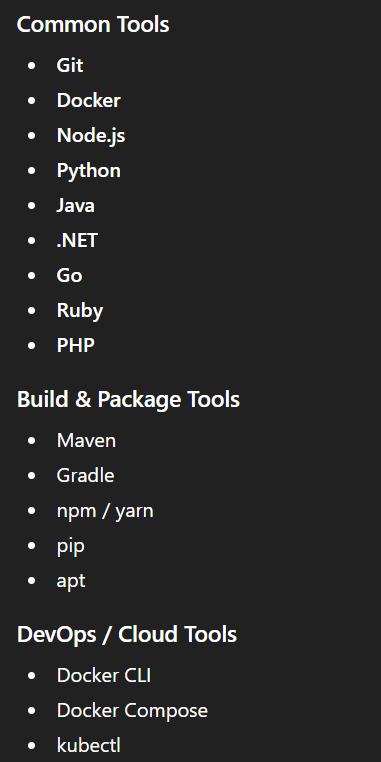

Write in your notes: Why does it matter that runners come with tools pre-installed? `ans : It matters that runners come with pre-installed tools because we do not have to manage infrastructure and workflow can run faster`

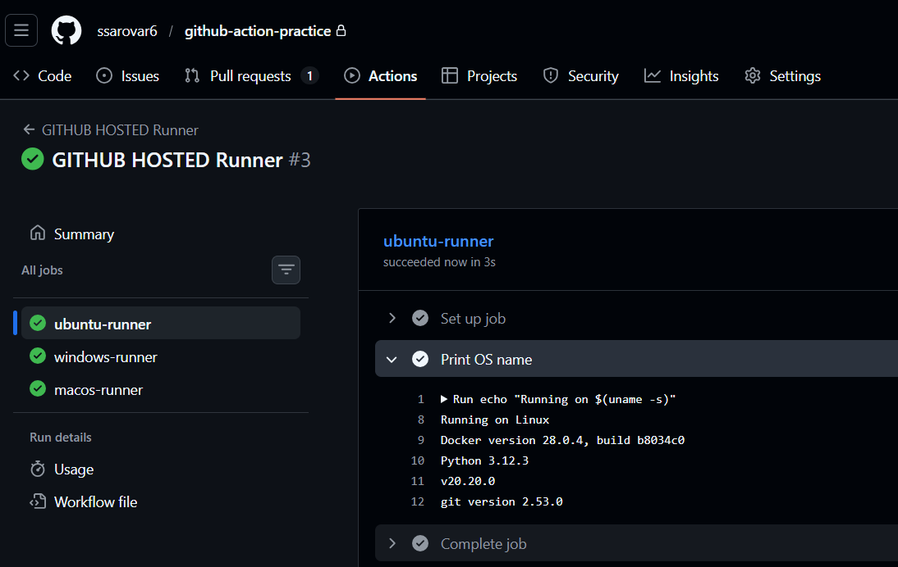
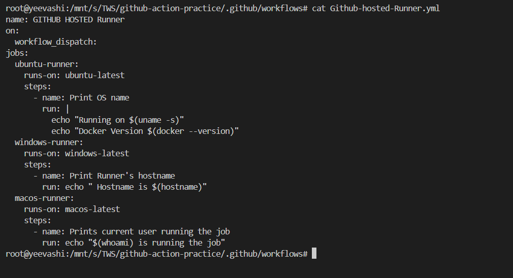

---

### Task 3: Set Up a Self-Hosted Runner
1. Go to your GitHub repo → Settings → Actions → Runners → **New self-hosted runner**
2. Choose Linux as the OS
3. Follow the instructions to download and configure the runner on:
   - Your local machine, OR
   - A cloud VM (EC2, Utho, or any VPS)
4. Start the runner — verify it shows as **Idle** in GitHub

**Verify:** Your runner appears in the Runners list with a green dot.

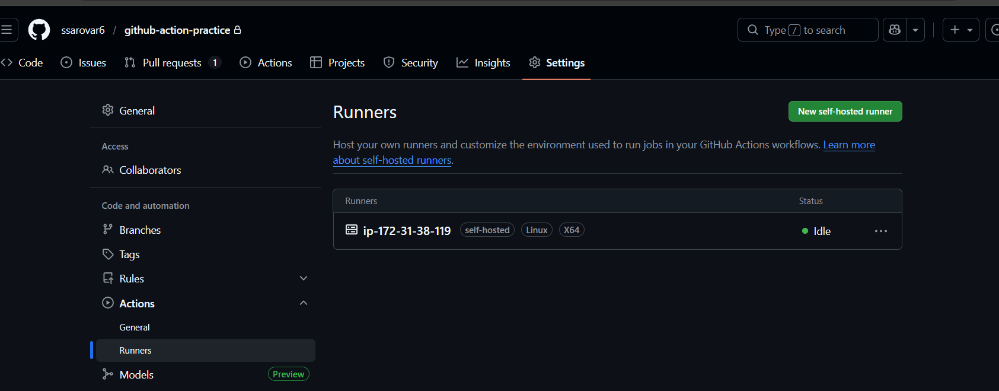
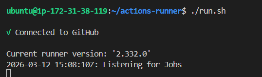

---

### Task 4: Use Your Self-Hosted Runner
1. Create `.github/workflows/self-hosted.yml`
2. Set `runs-on: self-hosted`
3. Add steps that:
   - Print the hostname of the machine (it should be YOUR machine/VM)
   - Print the working directory
   - Create a file and verify it exists on your machine after the run
4. Trigger it and watch it run on your own hardware

**Verify:** Check your machine — is the file there? `yes`

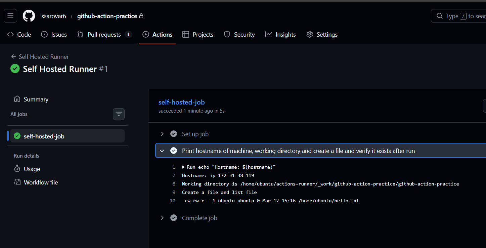
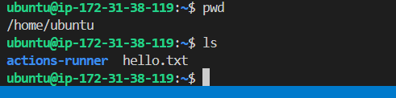
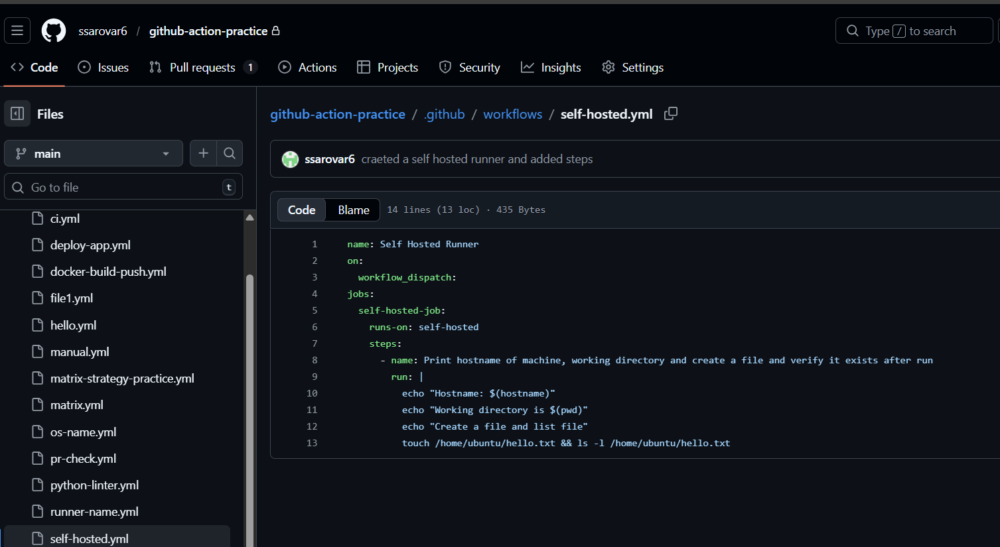
---

### Task 5: Labels
1. Add a **label** to your self-hosted runner (e.g., `my-linux-runner`)
2. Update your workflow to use `runs-on: [self-hosted, my-linux-runner]`
3. Trigger it — does it still pick up the job?

Write in your notes: Why are labels useful when you have multiple self-hosted runners?

---

### Task 6: GitHub-Hosted vs Self-Hosted
Fill this in your notes:

| | GitHub-Hosted | Self-Hosted |
|---|---|---|
| Who manages it? | Microsoft | User/Organization |
| Cost | Free for Public repository for 2,000 minutes/month | free on GitHub for public repositories |
| Pre-installed tools | yes | NO |
| Good for | organizations that do not want to manage infrastructure | organizations that want complete control over infrastructure |
| Security concern | there are security concern as resorces are shared  |  |

---

## Hints
- Runner setup script is generated by GitHub — just copy and run it
- Self-hosted runner runs as a background service: `./run.sh`
- To run as a service (persistent): `sudo ./svc.sh install && sudo ./svc.sh start`
- `runs-on: self-hosted` targets any self-hosted runner
- `runs-on: [self-hosted, linux, my-label]` targets specific ones

---