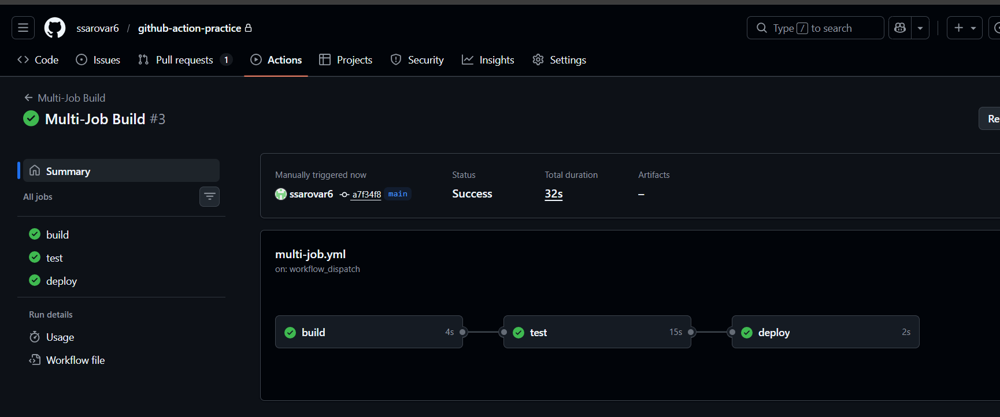
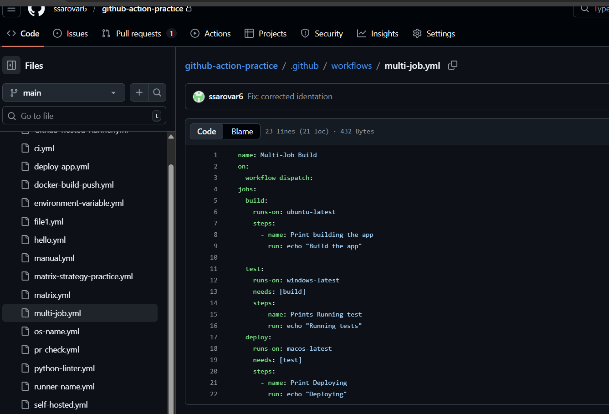
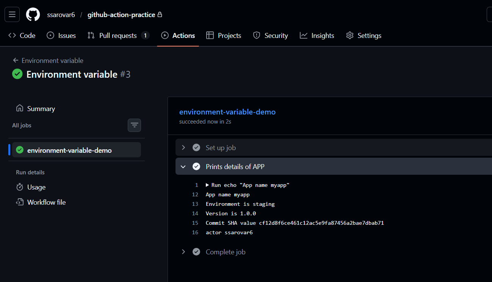
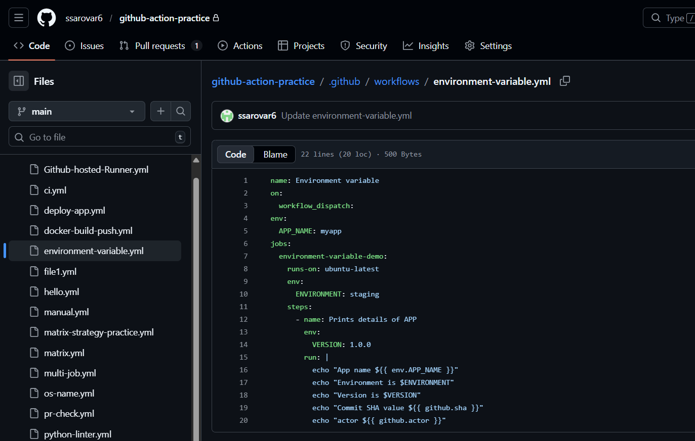
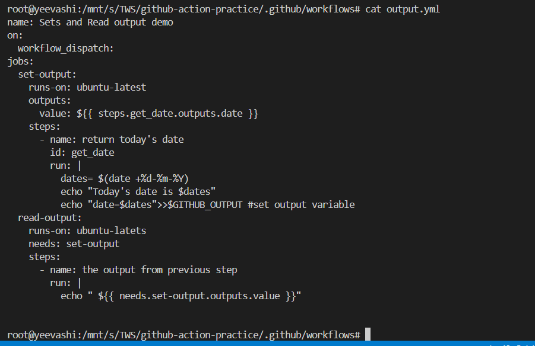
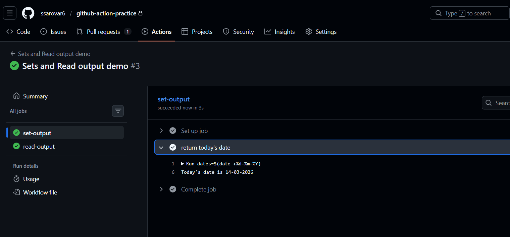
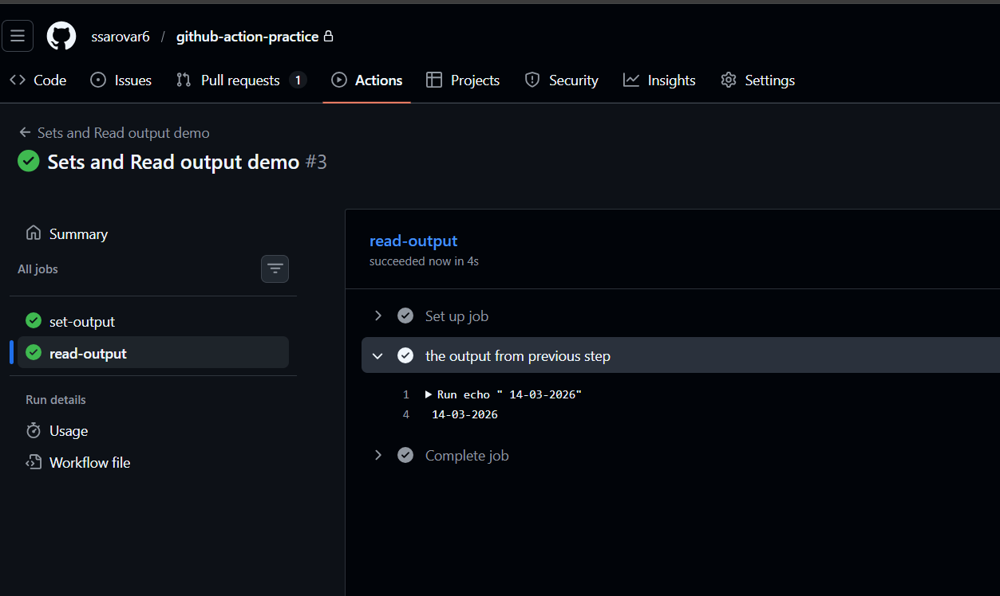
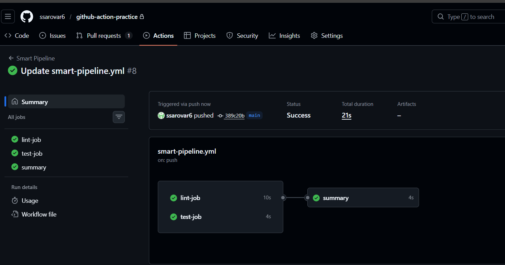
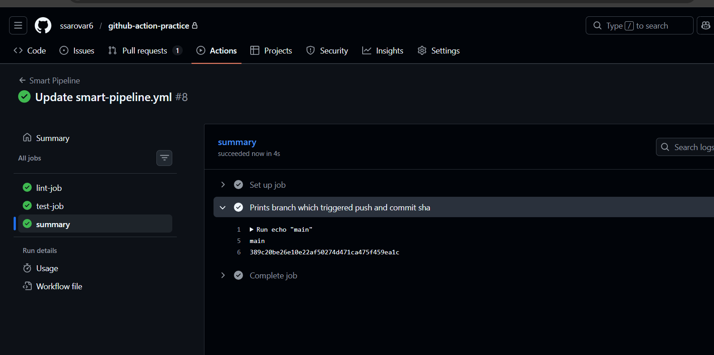
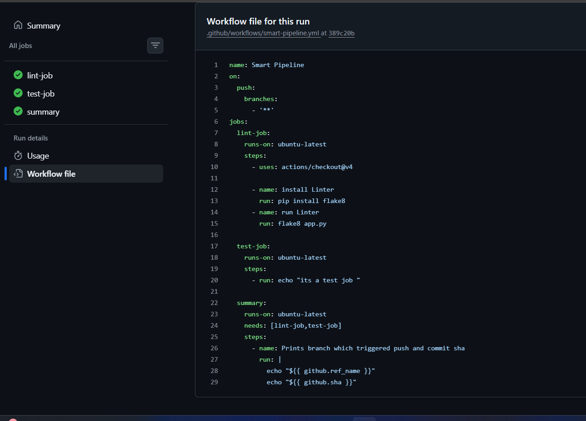

---

# Day 43 – Jobs, Steps, Env Vars & Conditionals

### Task 1: Multi-Job Workflow
Create `.github/workflows/multi-job.yml` with 3 jobs:
- `build` — prints "Building the app"
- `test` — prints "Running tests"
- `deploy` — prints "Deploying"

Make `test` run only **after** `build` succeeds.
Make `deploy` run only **after** `test` succeeds.

**Verify:** Check the workflow graph in the Actions tab — does it show the dependency chain?

---

### Task 2: Environment Variables
In a new workflow, use environment variables at 3 levels:
1. **Workflow level** — `APP_NAME: myapp`
2. **Job level** — `ENVIRONMENT: staging`
3. **Step level** — `VERSION: 1.0.0`

Print all three in a single step and verify each is accessible.

Then use a **GitHub context variable** — print the commit SHA and the actor (who triggered the run).

---

### Task 3: Job Outputs
1. Create a job that **sets an output** — e.g., today's date as a string
2. Create a second job that **reads that output** and prints it
3. Pass the value using `outputs:` and `needs.<job>.outputs.<name>`

Write in your notes: Why would you pass outputs between jobs? `ans :Jobs run on separate runners, so variables are not shared automatically, To allow dependent jobs to use results from previous jobs`

---

### Task 4: Conditionals
In a workflow, add:
1. A step that only runs when the branch is `main`
2. A step that only runs when the previous step **failed**
3. A job that only runs on **push** events, not on pull requests
4. A step with `continue-on-error: true` — what does this do?

---

### Task 5: Putting It Together
Create `.github/workflows/smart-pipeline.yml` that:
1. Triggers on push to any branch
2. Has a `lint` job and a `test` job running in parallel
3. Has a `summary` job that runs after both, prints whether it's a `main` branch push or a feature branch push, and prints the commit message

---

## Hints
- Job dependency: `needs: [job-name]`
- Set output: `echo "date=$(date)" >> $GITHUB_OUTPUT`
- Read output: `${{ needs.job-name.outputs.date }}`
- Conditionals: `if: github.ref == 'refs/heads/main'`
- Commit message: `${{ github.event.commits[0].message }}`

---
