# Day 44 – Secrets, Artifacts & Running Real Tests in CI

---

## Challenge Tasks

### Task 1: GitHub Secrets
1. Go to your repo → Settings → Secrets and Variables → Actions
2. Create a secret called `MY_SECRET_MESSAGE`
3. Create a workflow that reads it and prints: `The secret is set: true` (never print the actual value)
4. Try to print `${{ secrets.MY_SECRET_MESSAGE }}` directly — what does GitHub show? `github shows *** masked value`

Write in your notes: Why should you never print secrets in CI logs? `because if used directly in CI then secrets will be exposed and leads to unathorised access and Passwords being exposed.`

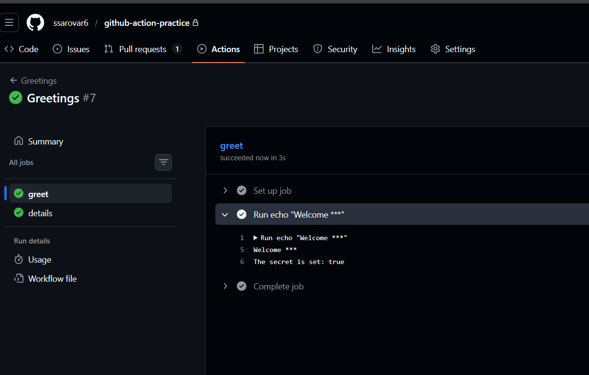
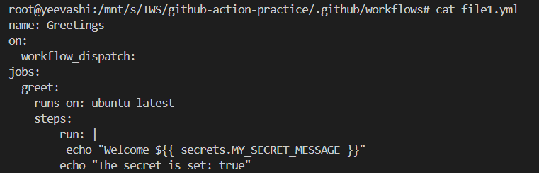

---

### Task 2: Use Secrets as Environment Variables
1. Pass a secret to a step as an environment variable
2. Use it in a shell command without ever hardcoding it
3. Add `DOCKER_USERNAME` and `DOCKER_TOKEN` as secrets (you'll need these on Day 45)

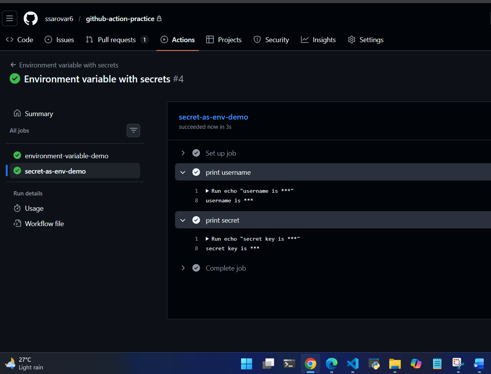
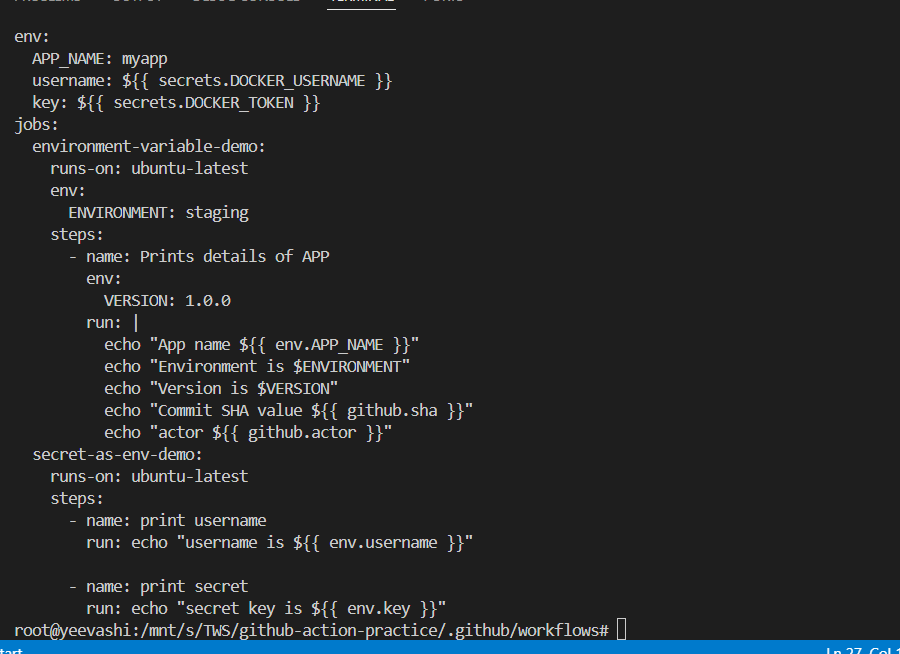

---

### Task 3: Upload Artifacts
1. Create a step that generates a file — e.g., a test report or a log file
2. Use `actions/upload-artifact` to save it
3. After the workflow runs, download the artifact from the Actions tab

**Verify:** Can you see and download it from GitHub? `no i cannot see in actions tab rather i can see it from a url displayed in workflow logs`

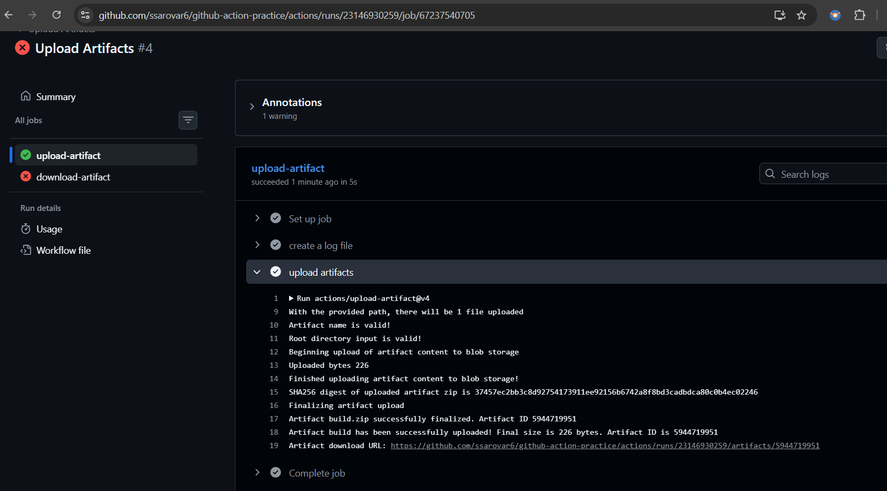
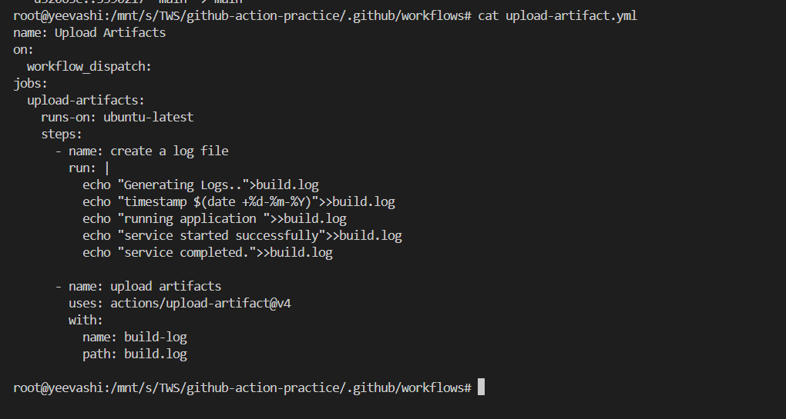

---

### Task 4: Download Artifacts Between Jobs
1. Job 1: generate a file and upload it as an artifact
2. Job 2: download the artifact from Job 1 and use it (print its contents)

Write in your notes: When would you use artifacts in a real pipeline? `In real pipeline i would use artifacts when preserve outputs, share files between jobs, support debugging, store reports, and enable deployments`

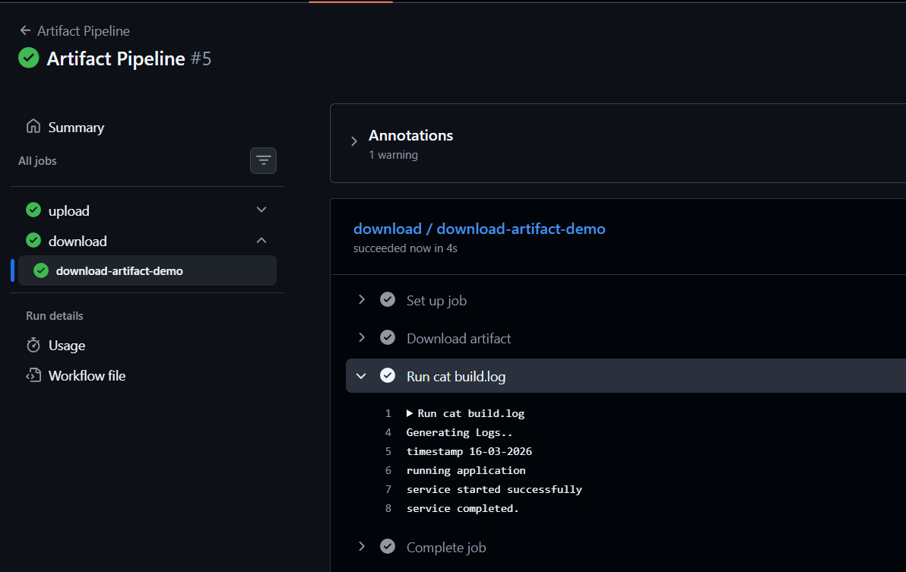
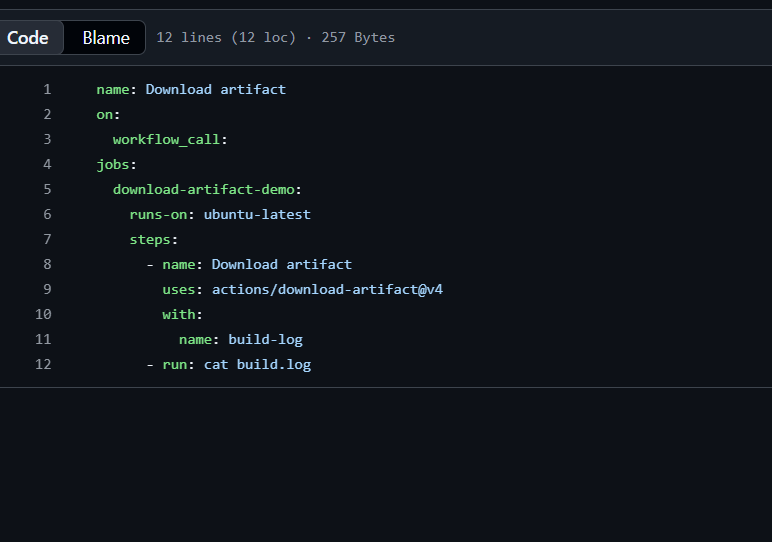

---

### Task 5: Run Real Tests in CI
Take any script from your earlier days (Python or Shell) and run it in CI:
1. Add your script to the `github-actions-practice` repo
2. Write a workflow that:
   - Checks out the code
   - Installs any dependencies needed
   - Runs the script
   - Fails the pipeline if the script exits with a non-zero code
3. Intentionally break the script — verify the pipeline goes red
4. Fix it — verify it goes green again

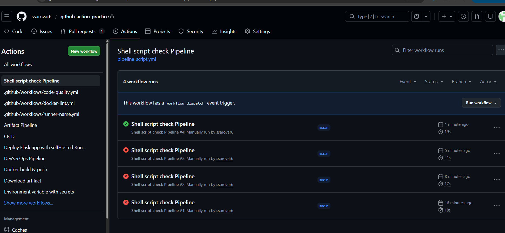
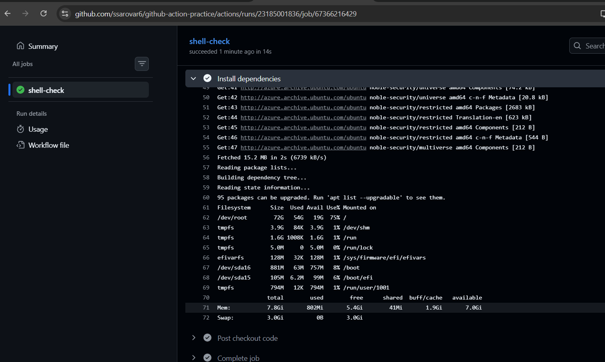
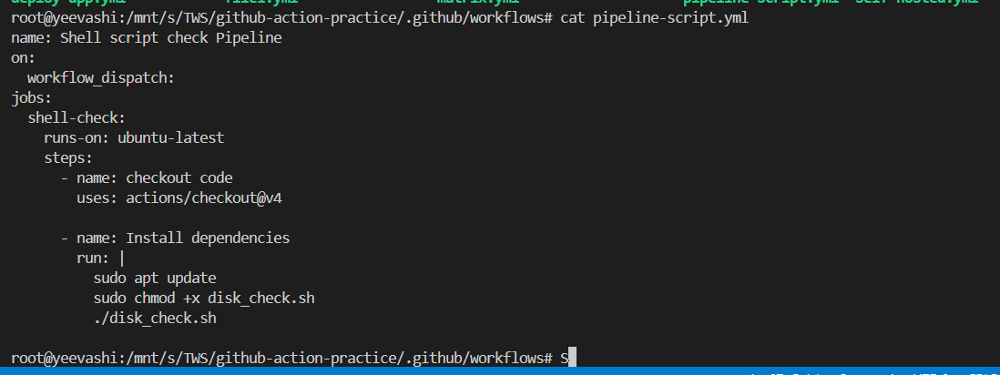

---

### Task 6: Caching
1. Add `actions/cache` to a workflow that installs dependencies
2. Run it twice — observe the time difference
3. Write in your notes: What is being cached and where is it stored?

---

## Hints
- Secrets: `${{ secrets.SECRET_NAME }}`
- Upload artifact: `uses: actions/upload-artifact@v4`
- Download artifact: `uses: actions/download-artifact@v4`
- Cache: `uses: actions/cache@v4`
- GitHub masks secret values in logs automatically