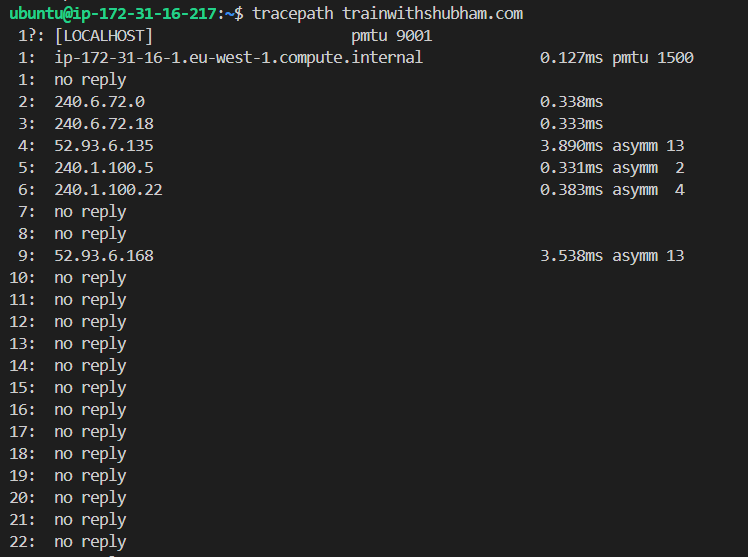
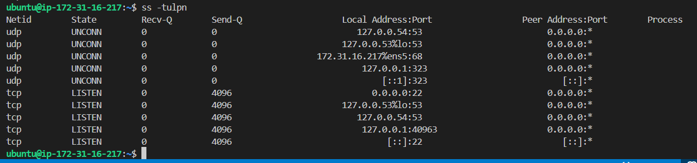
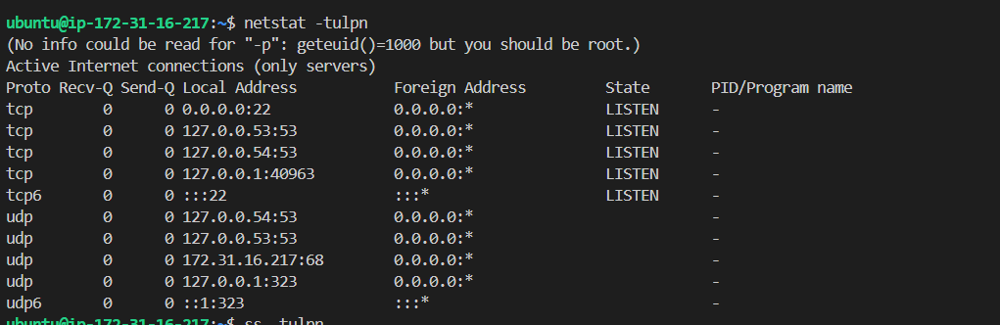
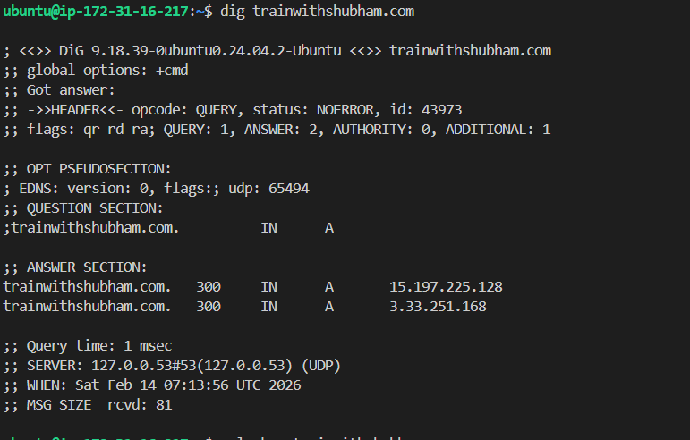
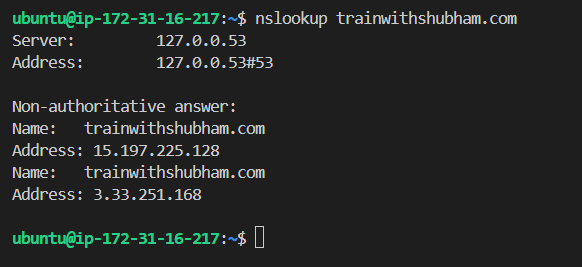
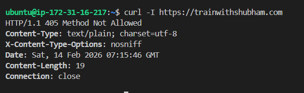
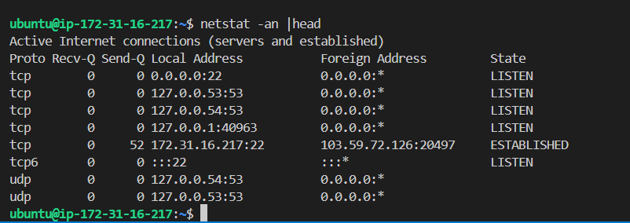

**OSI vs TCP/IP models** 

## Hands-on Checklist (run these; add 1–2 line observations)
- **Identity:** — note your IP.
 `hostname : ip-172-31-16-217`, `hostname -I: 172.31.16.217`

- **Reachability:** — mention latency and packet loss.
 `61 packets transmitted, 61 received, 0% packet loss, time 60069ms, rtt min/avg/max/mdev = 0.992/1.015/1.178/0.028 ms `

- **Path:**  — note any long hops/timeouts.

 

- **Ports:** `ss -tulpn` (or `netstat -tulpn`) — list one listening service and its port.

- **Name resolution:** `dig <domain>` or `nslookup <domain>` — record the resolved IP.

- **HTTP check:** `curl -I <http/https-url>` — note the HTTP status code.
 

- **Connections snapshot:** `netstat -an | head` — count ESTABLISHED vs LISTEN (rough).

