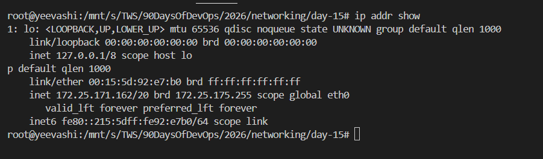

## Challenge Tasks
---
### Task 1: DNS – How Names Become IPs
1. Explain in 3–4 lines: what happens when you type `google.com` in a browser?
ans: 
- when I type google.com , a Google UI page loads 

2. What are these record types? Write one line each:
   - `A`, `AAAA`, `CNAME`, `MX`, `NS`
   ans: 
   - A: this is IPV4 record type which maps domain to to IPV4 address.
   - AAAA: this IPV6 record type which maps a domain to IPv6 adddress.
   - CNAME: stands for Canonical Name, also known as Alias record which maps one domain to another.
   - MX: stands for Mail Exchange server, it specifies a mail server for domain.
   - NS: stands for Name server, it specifies authoritative DNS server
   - PTR : Pointyer record type which provides reverse lookup i.e. from IP to domain.

3. Run: `dig google.com` — identify the A record and TTL from the output
``

 ans : google.com.             44      IN      A       142.250.183.174
 TTL value : 44

---

### Task 2: IP Addressing
1. What is an IPv4 address? How is it structured? (e.g., `192.168.1.10`).
ans: IPV4 address is a 32-bit number, usually written in dotted decimal format. It consist of 4 octets ranging from 0 to 255 separated by dots. e.g.-192.168.1.10
the address is split into 2 parts as Network ID and Host ID.

2. Difference between **public** and **private** IPs — give one example of each.
ans : public IP : IP's which are accessible on/over internet. e.g. web server and mail server.

Private IP : IP's which are only accessible in private network and devices can communicate internally with each other using the same IP without exhausting public IPs.
e.g. personal phone , watch etc.

3. What are the private IP ranges?
   - `10.x.x.x`, `172.16.x.x – 172.31.x.x`, `192.168.x.x`
ans: 3 IPV4 address ranges of private IP addresses:
- In Class A : 10.0.0.0 - 10.255.255.255.255
- In Class B : 172.16.0.0 - 172.31.255.255
- In Class C : 192.168.0.0 - 192.168.255.255

4. Run: `ip addr show` — identify which of your IPs are private
ans : 172.25.171.162

---

### Task 3: CIDR & Subnetting
1. What does `/24` mean in `192.168.1.0/24`?
ans: In `192.168.1.0/24` /24 means CIDR Value which specify which application will have what IP address and total number of IP address. Longer the CIDR value shorter number of IP address available.
Therefore, `192.168.1.0/24` has (32-24=8, 2^8=256) 254 IP address(2 IPs are reserved).

2. How many usable hosts in a `/24`? A `/16`? A `/28`?
ans: calculating Usable host:
`/24` 
- total bits = 32
- network bits = 24
- host bits = 32-24 = 8
- therefore, usable host = 2^8 = 256-2=254

`/16`
- total bits = 32
- network bits = 16
- host bits = 32-16 = 16
- therefore, usable host = 2^16 = 65,536-2=65534

`/28`
- total bits = 32
- network bits = 28
- host bits = 32-28 = 4
- therefore, usable host = 2^4 = 16-2=14

3. Explain in your own words: why do we need subnet?
ans:
- we need subnet to provide isolation to networks.
- to manage large IP network,
- it divides larger network into smaller segments for better IP management.

4. Quick exercise — fill in:

| CIDR | Subnet Mask     | Total IPs | Usable Hosts |
|------|-----------------|-----------|--------------|
| /24  | 255.255.255.0   | 256       |254           |
| /16  |                 | ?         | ?            |
| /28  | 255.255.255.240 | 16        | 14            |

---

### Task 4: Ports – The Doors to Services
1. What is a port? Why do we need them?
ans : Port is logical identifier used to distinguish diffrent application and service.
 we need port for efficient data routing, application/service identification, traffic control and security.

2. Document these common ports:

| Port | Service |
|------|---------|
| 22   | SSH     |
| 80   | HTTP    |
| 443  | HTTPS   |
| 53   | DNS     |
| 3306 | Database|
| 6379 | Redis   |
| 27017| MongoDb |

3. Run `ss -tulpn` — match at least 2 listening ports to their services
``

---

### Task 5: Putting It Together
Answer in 2–3 lines each:
- You run `curl http://myapp.com:8080` — what networking concepts from today are involved?

- Your app can't reach a database at `10.0.1.50:3306` — what would you check first?
  ans : I will check security group if 3306 port is enabled for data routing.
 also telnet 10.0.1.50:3306

---

## What you learned (3 key points)
- learnet about port(what , why and how)
- learned about IP adressing(what, why and how)
- learned about record type
