# Day 75 -- Log Management with Loki and Promtail

the second pillar of observability -- logs.


## Challenge Tasks

### Task 1: Understand the Logging Pipeline
Before writing any config, understand how the pieces fit together:

```
[Docker Containers]
       |
       | (write JSON logs to /var/lib/docker/containers/)
       v
  [Promtail]
       |
       | (reads log files, adds labels, pushes to Loki)
       v
    [Loki]
       |
       | (stores logs, indexes by labels)
       v
   [Grafana]
       |
       | (queries Loki with LogQL, displays logs)
       v
   [You]
```

Key differences from the ELK stack:
- Loki does **not** index the full text of logs -- it only indexes labels (like container name, job, filename)
- This makes Loki much cheaper to run and simpler to operate
- Think of it as "Prometheus, but for logs" -- same label-based approach

what is Loki? how it is different from Grafana?
ans = Grafana Loki is a log aggregation system (storage/backend) that collects and indexes logs, while Grafana is a visualization tool (frontend/dashboard) used to query, display, and analyze that data.
Loki: Does not have a native user interface.
Grafana: Provides the primary GUI interface for users to visualize the logs

**Document:** Why does Loki only index labels instead of full text? What is the trade-off? ans = Loki only index labels instead of full-text conetnt to achieve significant cost efficiency and high scalability. Loki’s label-only index is typically <1% of the total log volume, Because the index is small, Loki can use low-cost object storage (like AWS S3 or GCS) for log data.
Key Trade-offs:
a. Slower Full-Text Searching: Searching for a specific string (e.g., "error" or a specific user ID) requires scanning through raw log chunks. This makes "needle in a haystack" searches slower compared to systems that index every word. 
b. High Cardinality Issues: If you use too many labels with unique values (e.g., user IDs, order IDs), Loki creates thousands of tiny, separate log streams. This can overwhelm the system, causing memory pressure on ingesters. 
c. Labeling is Crucial: The success of a query depends on having a good set of labels (low cardinality, stable). If a user searches for something not covered by the label structure, the entire stream must be scanned

---

### Task 2: Add Loki to the Stack 
 [Note For me - i was creating loki directory with docker-compose.yml and loki-config.yml file, and in docker-compose.yml i mentioned "volumes: - ./loki/loki-config.yml:/etc/loki/loki-config.yml" . this is incorrect, since i am adding docker-compose.yml file in same /loki directory so i do not need to add ./loki/.. in volumes , if my file was in different location then it is correct but my file is in same location hence correct content would be - "volumes: ./loki-config.yml:/etc/loki/loki-config.yml"  ]

 [Note for me - I can do above and this as well .
 what i did is i removed docker-compose.yml file from /loki directory and created in path - /home/ubuntu/docker-compose.yml and kept the original content for volume as "volumes: - ./loki/loki-config.yml:/etc/loki/loki-config.yml" . this also worked. This is better because i do not have to create docker-compose for each specifically.]

[Note for me - Lastly i added /loki and /promtail directory in observability-stack directory and docker-compose.yml . This is correct and worked]

Create the Loki configuration file.

```bash
mkdir -p loki
```

Create `loki/loki-config.yml`:
```yaml
auth_enabled: false

server:
  http_listen_port: 3100

common:
  ring:
    instance_addr: 127.0.0.1
    kvstore:
      store: inmemory
  replication_factor: 1
  path_prefix: /loki

schema_config:
  configs:
    - from: 2020-10-24
      store: tsdb
      object_store: filesystem
      schema: v13
      index:
        prefix: index_
        period: 24h

storage_config:
  filesystem:
    directory: /loki/chunks
```

**What this config does:**
- `auth_enabled: false` -- single-tenant mode, no authentication needed
- `store: tsdb` -- uses Loki's time-series database for indexing
- `object_store: filesystem` -- stores log chunks on local disk
- `replication_factor: 1` -- single instance, no replication (fine for learning)

Add Loki to your `docker-compose.yml`:
```yaml
  loki:
    image: grafana/loki:latest
    container_name: loki
    ports:
      - "3100:3100"
    volumes:
      - ./loki/loki-config.yml:/etc/loki/loki-config.yml
      - loki_data:/loki
    command: -config.file=/etc/loki/loki-config.yml
    restart: unless-stopped
```

Add `loki_data` to your volumes section:
```yaml
volumes:
  prometheus_data:
  grafana_data:
  loki_data:
```

Start Loki:
```bash
docker compose up -d loki
```
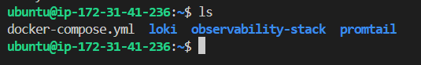
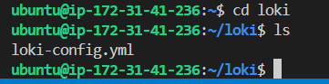
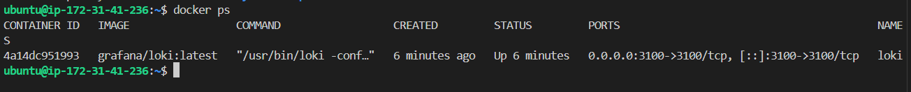
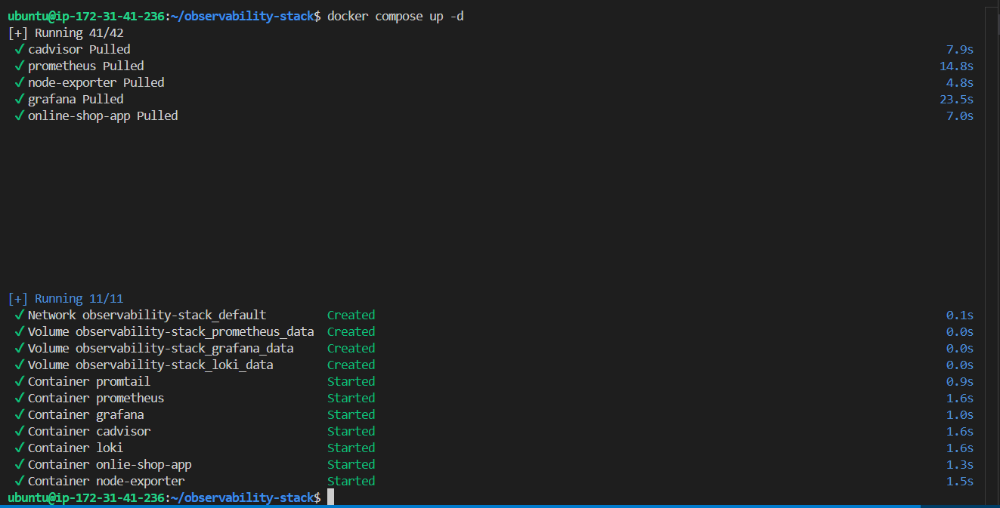

Verify Loki is running:
```bash
curl http://localhost:3100/ready
```

You should see `ready`.

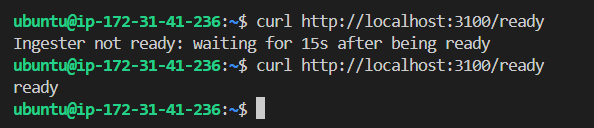

---

### Task 3: Add Promtail to Collect Container Logs
Promtail is the log collection agent. It reads Docker container log files from the host and pushes them to Loki.

```bash
mkdir -p promtail
```

Create `promtail/promtail-config.yml`:
```yaml
server:
  http_listen_port: 9080
  grpc_listen_port: 0

positions:
  filename: /tmp/positions.yaml

clients:
  - url: http://loki:3100/loki/api/v1/push

scrape_configs:
  - job_name: docker
    static_configs:
      - targets:
          - localhost
        labels:
          job: docker
          __path__: /var/lib/docker/containers/*/*-json.log
    pipeline_stages:
      - docker: {}
```

**What this config does:**
- `positions` -- tracks which log lines have already been shipped (like a bookmark)
- `clients` -- where to send logs (Loki endpoint)
- `__path__` -- the glob pattern to find Docker JSON log files on the host
- `pipeline_stages: docker: {}` -- parses the Docker JSON log format and extracts timestamp, stream (stdout/stderr), and the log message

Add Promtail to your `docker-compose.yml`:
```yaml
  promtail:
    image: grafana/promtail:latest
    container_name: promtail
    volumes:
      - ./promtail/promtail-config.yml:/etc/promtail/promtail-config.yml
      - /var/lib/docker/containers:/var/lib/docker/containers:ro
      - /var/run/docker.sock:/var/run/docker.sock
    command: -config.file=/etc/promtail/promtail-config.yml
    restart: unless-stopped
```

**Why these volume mounts?**
- `/var/lib/docker/containers` -- where Docker stores container log files (read-only)
- `/var/run/docker.sock` -- lets Promtail discover container metadata (names, labels)

Restart the stack:
```bash
docker compose up -d
```


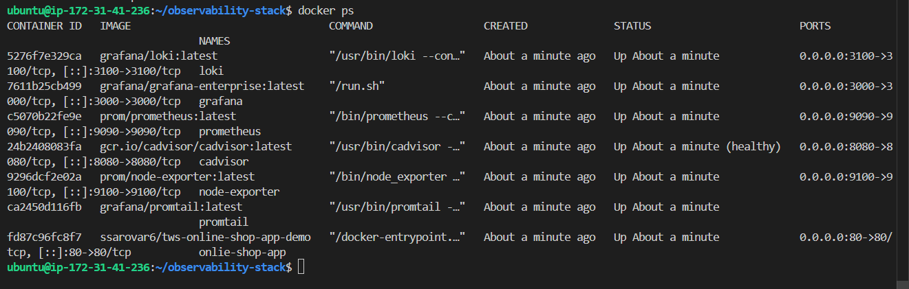

Generate some logs by hitting the online-shop app:
```bash
for i in $(seq 1 20); do curl -s http://localhost:80 > /dev/null; done
```

---

### Task 4: Add Loki as a Grafana Datasource
You can add it manually through the UI or auto-provision it with YAML.

**Option A -- Provision via YAML (recommended):**

Update `grafana/provisioning/datasources/datasources.yml`:
```yaml
apiVersion: 1

datasources:
  - name: Prometheus
    type: prometheus
    access: proxy
    url: http://prometheus:9090
    isDefault: true
    editable: false

  - name: Loki
    type: loki
    access: proxy
    url: http://loki:3100
    editable: false
```

Restart Grafana to pick up the new datasource:
```bash
docker compose restart grafana
```

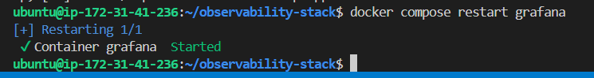

**Option B -- Manual UI setup:**
1. Go to Connections > Data Sources > Add data source
2. Select Loki
3. URL: `http://loki:3100`
4. Save & Test

Either way, you should now have two datasources in Grafana: Prometheus and Loki.

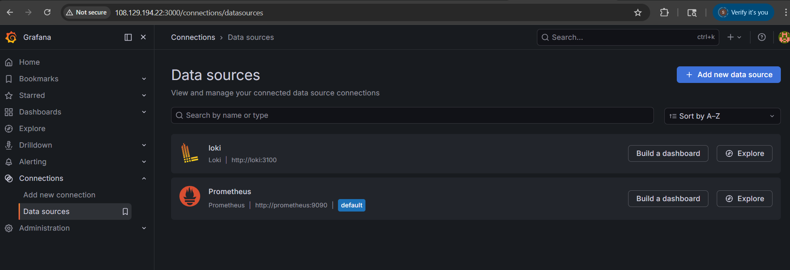

---

### Task 5: Query Logs with LogQL
LogQL is Loki's query language -- similar to PromQL but for logs.

Go to Grafana > Explore (compass icon). Select Loki as the datasource.

1. **Stream selector** -- filter logs by labels:
```logql
{job="docker"}
```
This shows all Docker container logs.

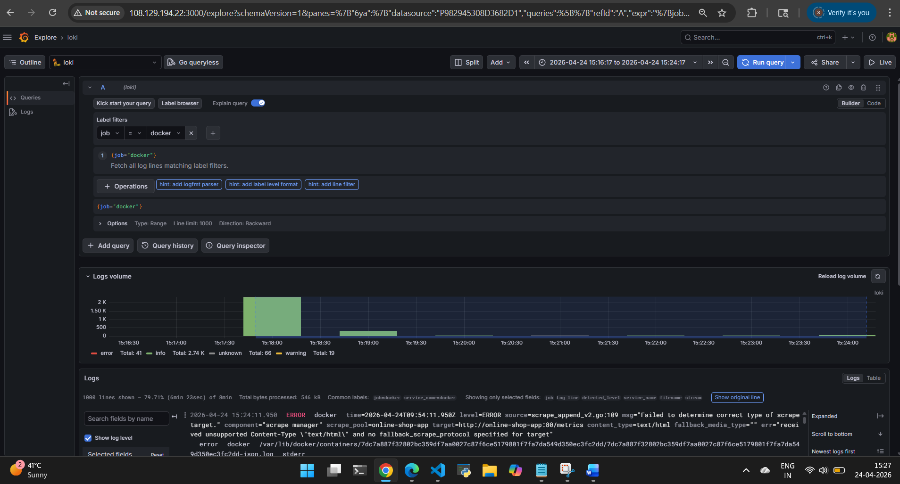
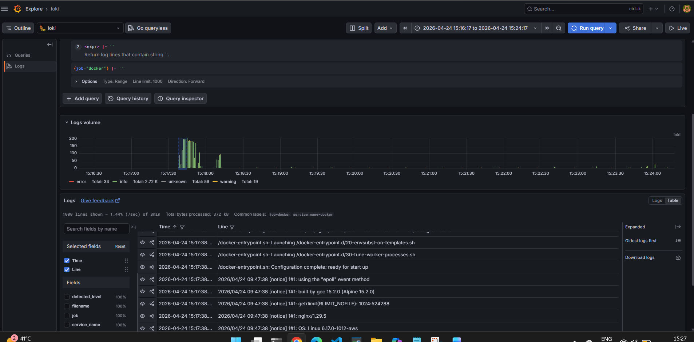
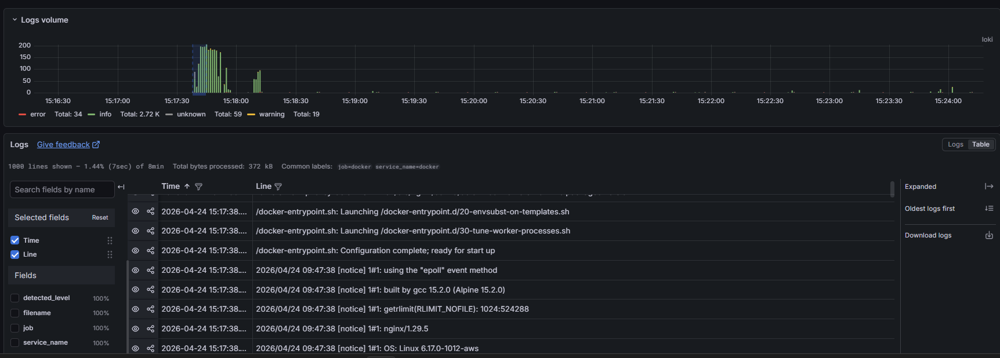

2. **Filter by container name:**
```logql
{container_name="prometheus"}  OR {job="docker"} |= "prometheus"
```

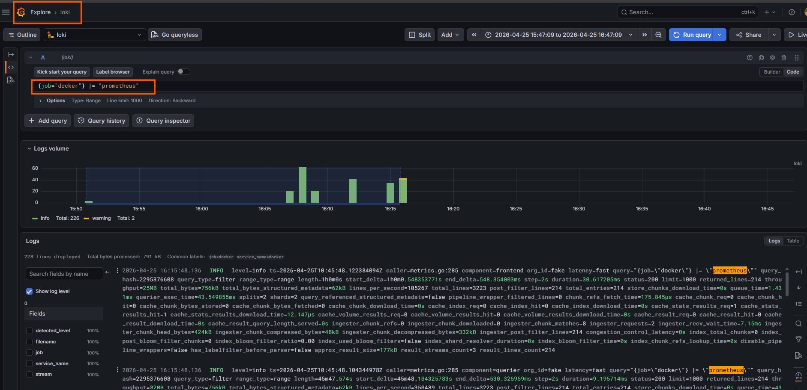

3. **Keyword search** -- filter log lines by content:
```logql
{job="docker"} |= "error"
```
`|=` means "line contains". This finds all log lines with the word "error".

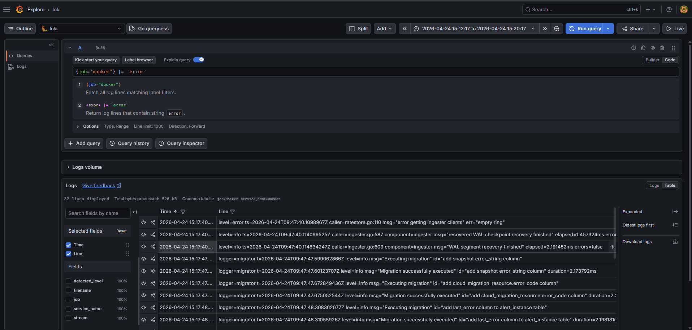
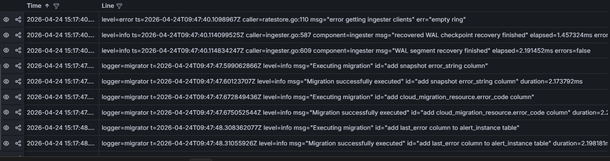
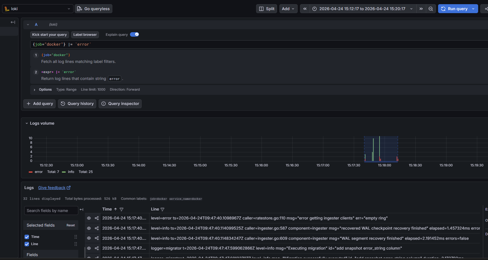

4. **Negative filter:**
```logql
{job="docker"} != "health"
```
Excludes lines containing "health" (useful to filter out health check noise).

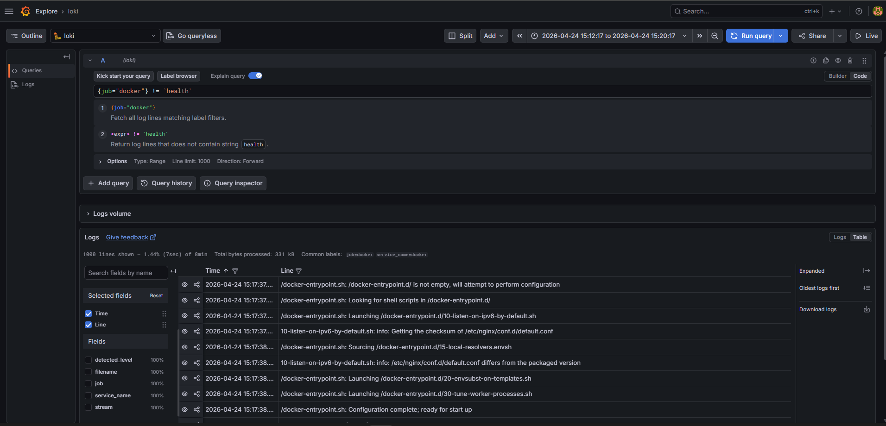
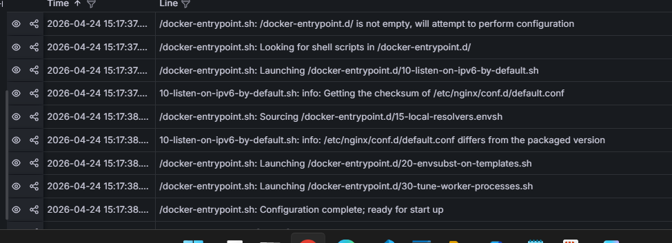
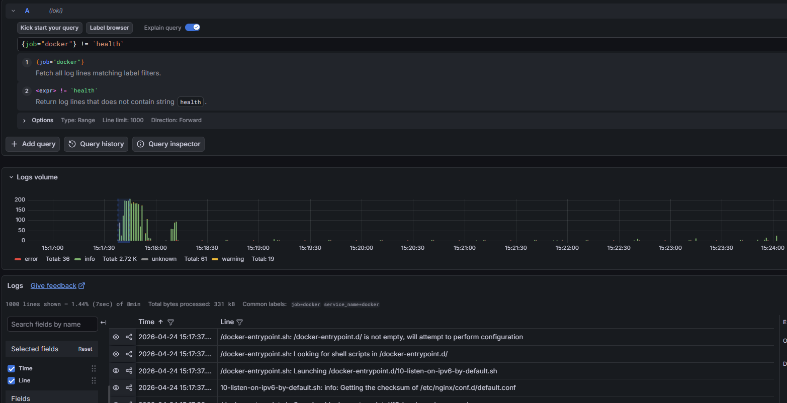

5. **Regex filter:**
```logql
{job="docker"} |~ "status=[45]\\d{2}"
```
Finds lines with HTTP 4xx or 5xx status codes.

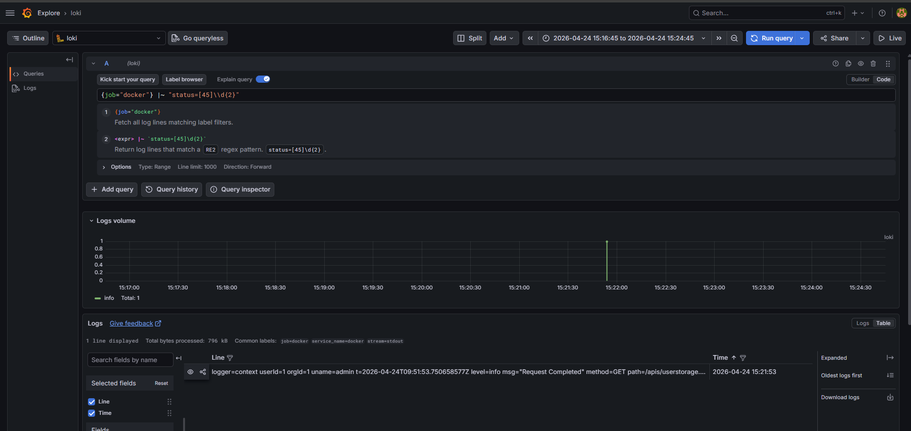


6. **Log metric queries** -- count log lines over time:
```logql
count_over_time({job="docker"}[5m])
```
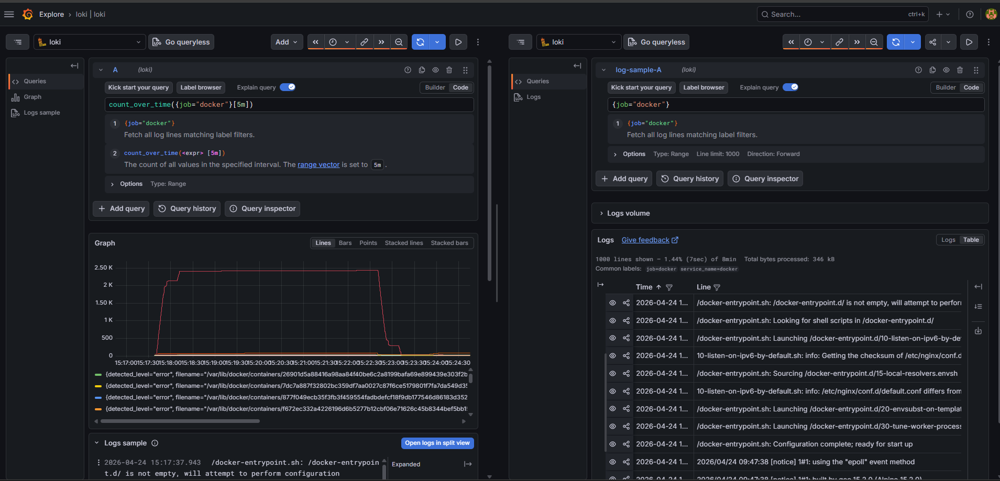
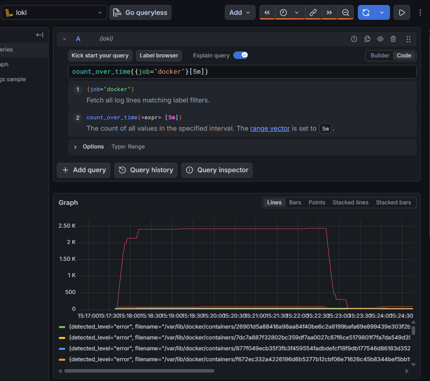


7. **Rate of logs per second:**
```logql
rate({job="docker"}[5m])
```

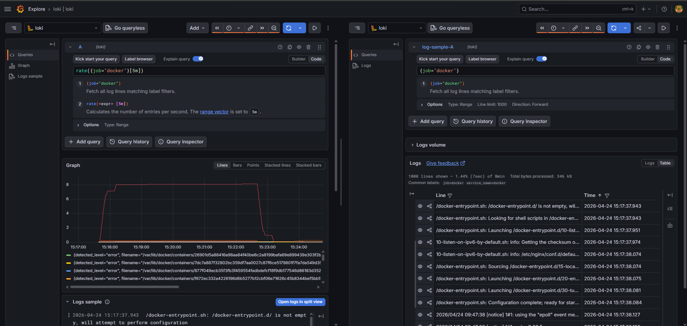

8. **Top containers by log volume:**
```logql
topk(5, sum by (container_name) (rate({job="docker"}[5m])))
```

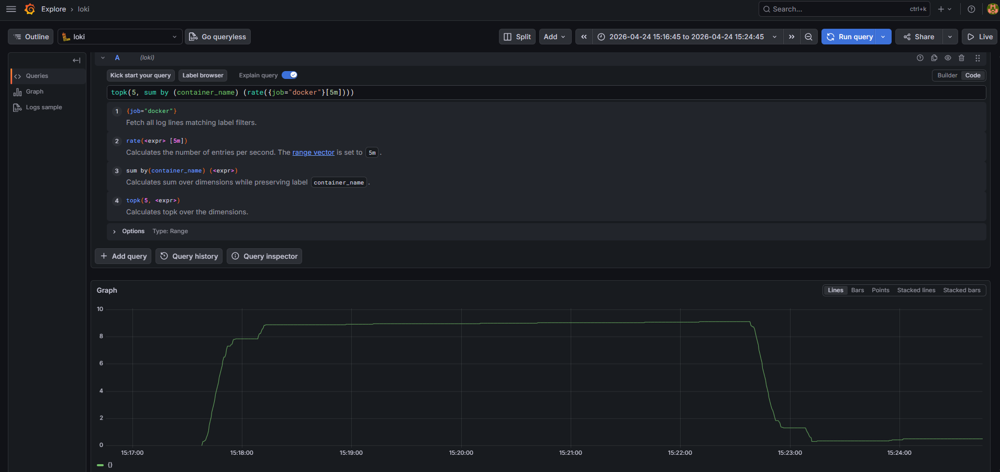
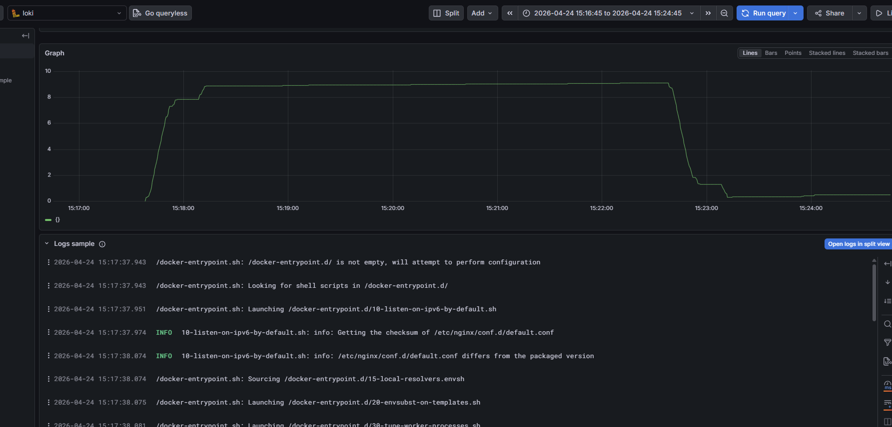

**Exercise:** Write a LogQL query that finds all error logs from the notes-app container in the last 1 hour. Then write another query that counts how many error lines per minute.

{job="docker"} |= "online-shop-app" |= "error" 
count_over_time({job="docker"} |= "online-shop-app" |= "error"[1m])

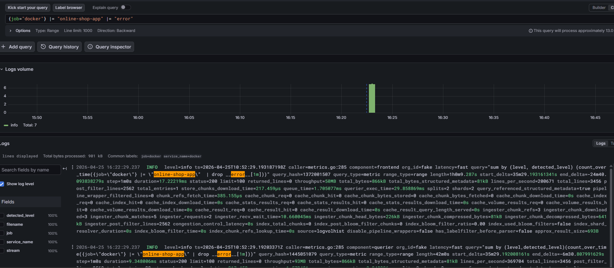
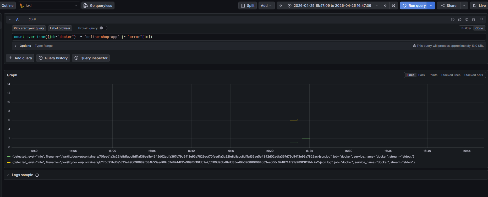

---

### Task 6: Correlate Metrics and Logs in Grafana
The real power of observability is correlation -- seeing metrics and logs together.

1. **Add a logs panel to your dashboard:**
   - Open the dashboard you built on Day 74
   - Add a new panel
   - Select Loki as the datasource
   - Query: `{job="docker"}`
   - Visualization: Logs
   - Title: "Container Logs"

   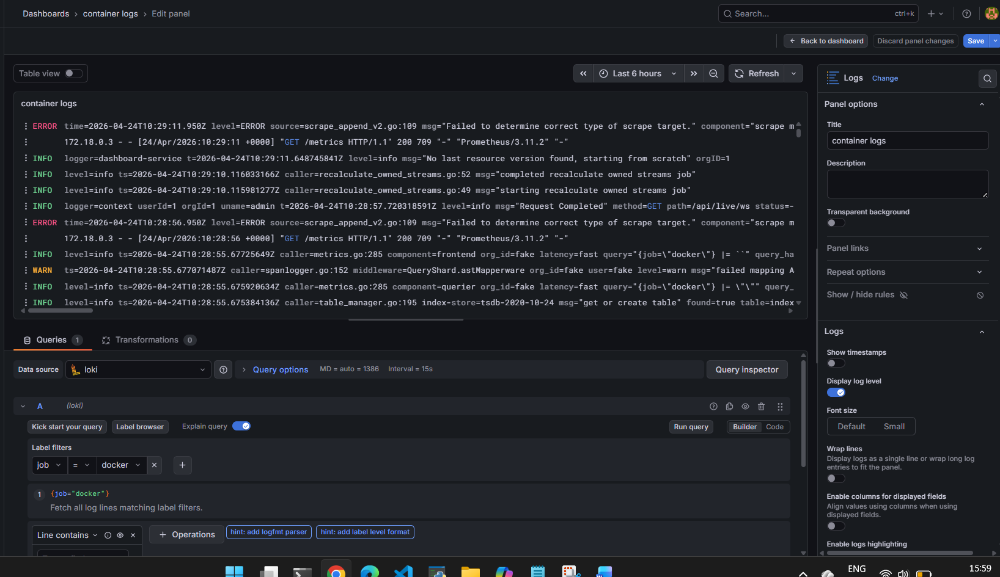

2. **Use the Explore split view:**
   - Go to Explore
   - Click the split button (two panels side by side)
   - Left panel: Prometheus -- `rate(container_cpu_usage_seconds_total{name="notes-app"}[5m])`
   - Right panel: Loki -- `{container_name="online-shop-app"}`
   - Now you can see CPU spikes and the corresponding log output at the same time


3. **Time sync:** Click on a spike in the metrics graph and both panels will zoom to that time range. This is how you debug in production -- you see a metric anomaly and immediately check the logs from that exact moment.

**Document:** How does having metrics and logs in the same tool (Grafana) help during incident response compared to checking separate systems?
ans = Having metrics and logs in a single tool like Grafana significantly speeds up incident response by eliminating the need to context-switch between disparate systems, reducing the time spent correlating data, and providing a seamless "detect-to-debug" workflow. When using separate systems, responders often have to manually copy-paste timestamps and IDs between a monitoring tool (like Prometheus) and a logging tool (like Splunk or Kibana), which increases Mean Time To Recovery (MTTR)

---

## Hints
- Loki labels are like Prometheus labels -- keep cardinality low (container name and job are good; user ID or request ID as labels would kill performance)
- `|=` is case-sensitive. Use `|~ "(?i)error"` for case-insensitive matching
- If you see no logs in Grafana, check: is Promtail running? Is it reading from the correct path? Check Promtail targets at `http://localhost:9080/targets`
- On macOS with Docker Desktop, the Docker log path (`/var/lib/docker/containers/`) is inside the Docker VM -- Promtail needs to run as a container to access it
- Loki is not a replacement for full-text search engines (Elasticsearch). It trades search power for simplicity and cost
- `positions.yaml` tracks read progress -- if you delete it, Promtail re-reads all logs
- Reference repo: https://github.com/LondheShubham153/observability-for-devops -- check `loki/` and `promtail/` directories

---