# Day 77 -- Observability Project: Full Stack with Docker Compose

### Task 1: Clone and Launch the Reference Stack
Clone the reference repository that contains the complete observability setup:

```bash
git clone https://github.com/LondheShubham153/observability-for-devops.git
cd observability-for-devops
```

Examine the project structure:
```bash
tree -I 'node_modules|build|staticfiles|__pycache__'
```

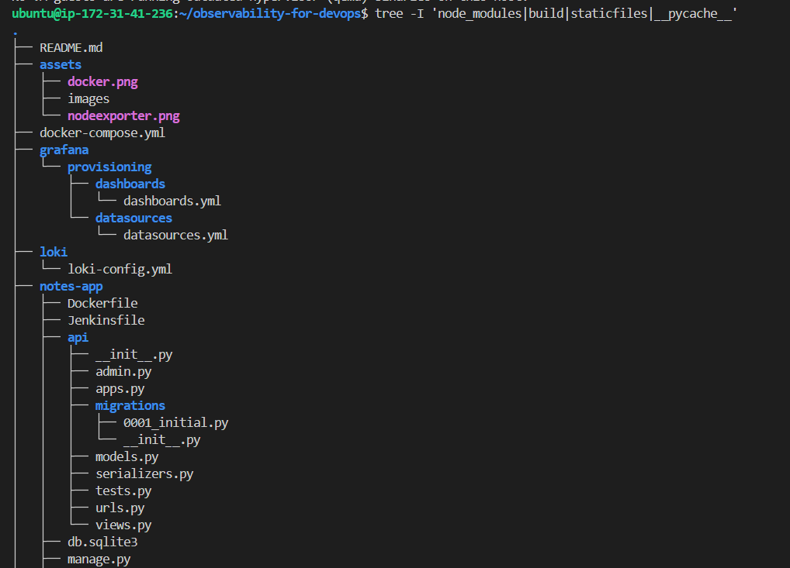
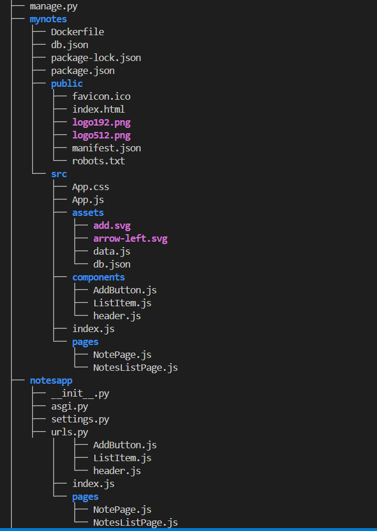
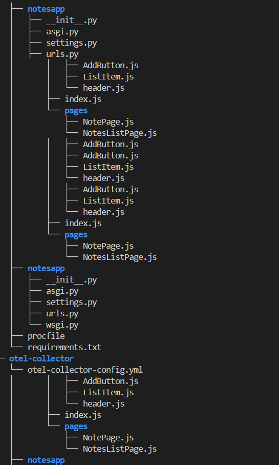
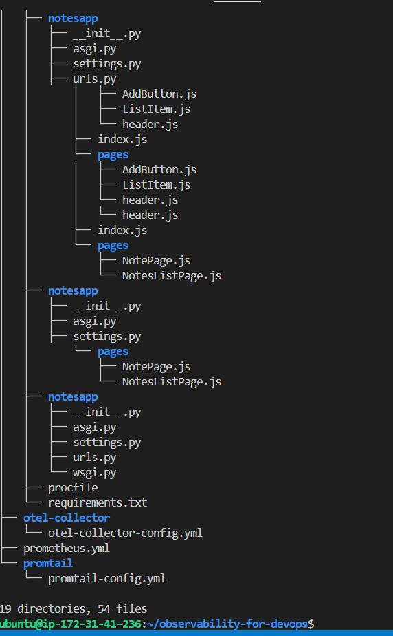

```
observability-for-devops/
  docker-compose.yml                    # 8 services orchestrated together
  prometheus.yml                        # Prometheus scrape configuration
  alert-rules.yml                       # (you will add this)
  grafana/
    provisioning/
      datasources/datasources.yml       # Auto-provisioned: Prometheus + Loki
      dashboards/dashboards.yml         # Dashboard provisioning config
  loki/
    loki-config.yml                     # Loki storage and schema config
  promtail/
    promtail-config.yml                 # Docker log collection config
  otel-collector/
    otel-collector-config.yml           # OTLP receivers, processors, exporters
  notes-app/                            # Sample Django + React application
```

Launch the entire stack:
```bash
docker compose up -d
```

Wait for all containers to start:
```bash
docker compose ps
```

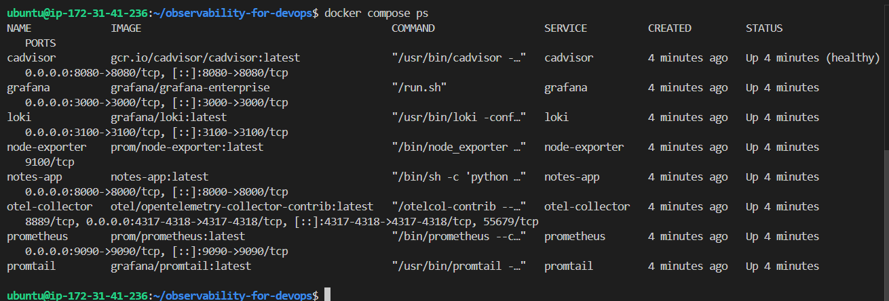

All 8 services should show as running:

| Service | Port | Check |
|---------|------|-------|
| Prometheus | 9090 | `http://localhost:9090` |
| Node Exporter | 9100 | `curl http://localhost:9100/metrics \| head -5` |
| cAdvisor | 8080 | `http://localhost:8080` |
| Grafana | 3000 | `http://localhost:3000` (admin/admin) |
| Loki | 3100 | `curl http://localhost:3100/ready` |
| Promtail | 9080 | Internal only |
| OTEL Collector | 4317/4318 | `docker logs otel-collector` |
| Notes App | 8000 | `http://localhost:8000` |

---

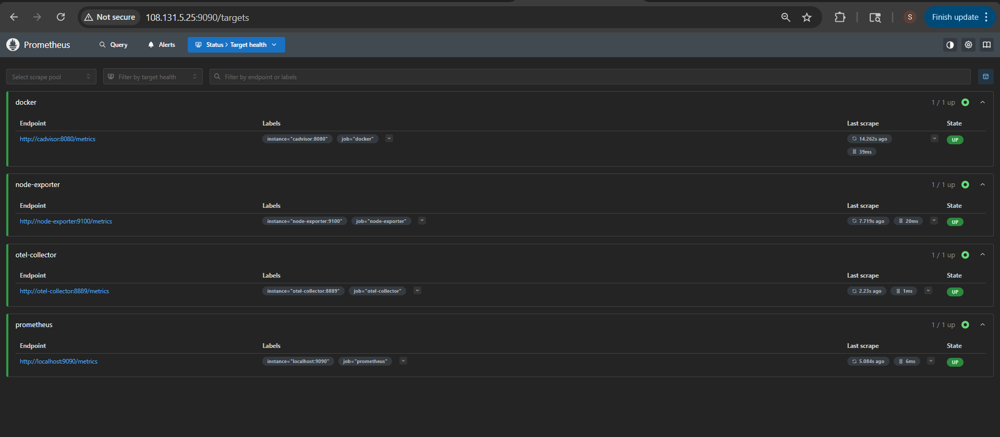
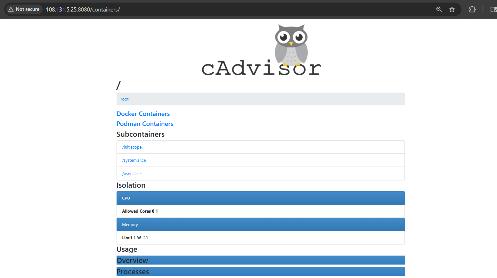
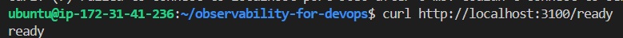
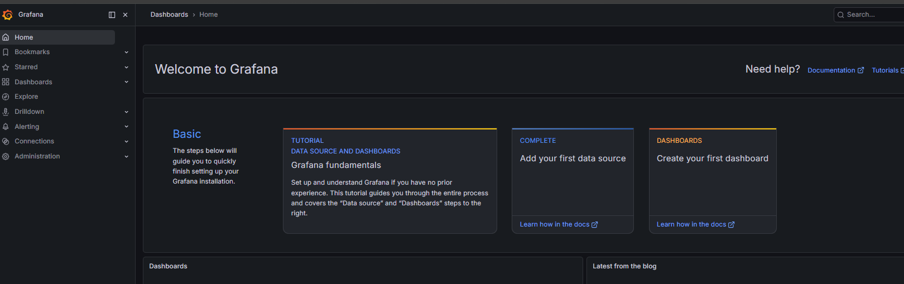
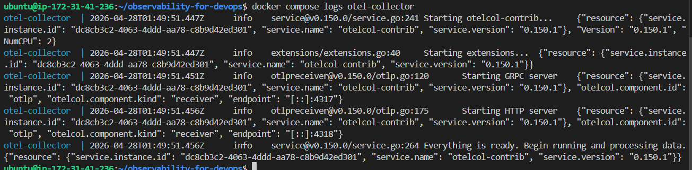
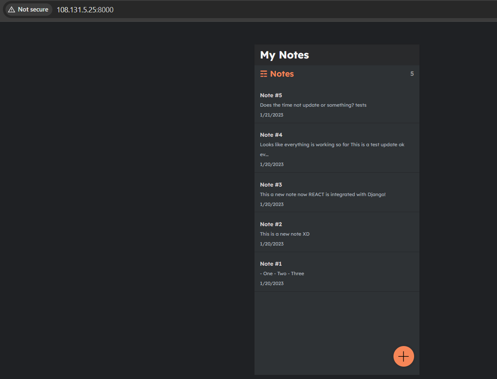


### Task 2: Validate the Metrics Pipeline
Confirm Prometheus is scraping all targets:

1. Open `http://localhost:9090/targets`

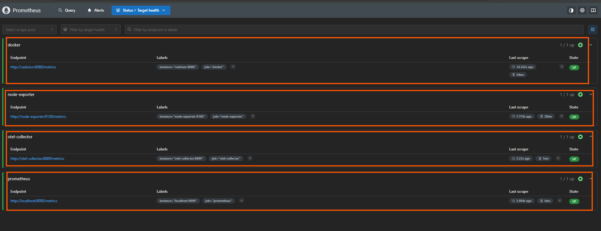

2. Verify all 4 scrape jobs are UP:
   - `prometheus` (self-monitoring)
   - `node-exporter` (host metrics)
   - `docker` / `cadvisor` (container metrics)
   - `otel-collector` (OTLP metrics)

Run these validation queries:
```promql
# All targets are healthy
up

# Host CPU usage
100 - (avg(rate(node_cpu_seconds_total{mode="idle"}[5m])) * 100)

# Memory usage
(1 - node_memory_MemAvailable_bytes / node_memory_MemTotal_bytes) * 100

# Container CPU per container
rate(container_cpu_usage_seconds_total{name!=""}[5m]) * 100

# Top 3 memory-hungry containers
topk(3, container_memory_usage_bytes{name!=""})
```

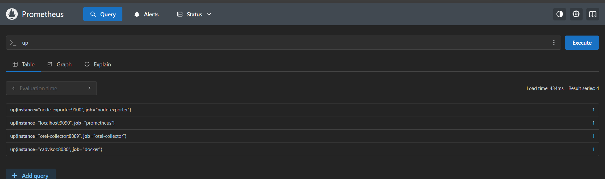
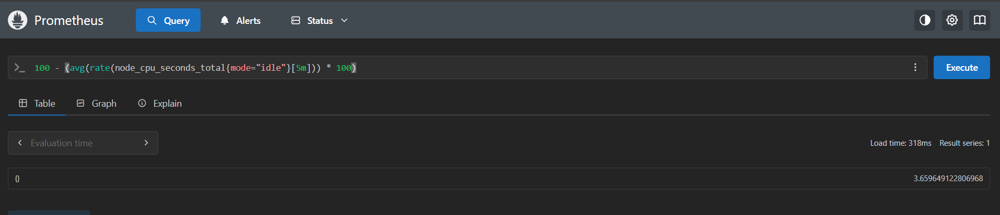
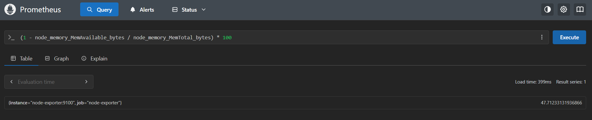
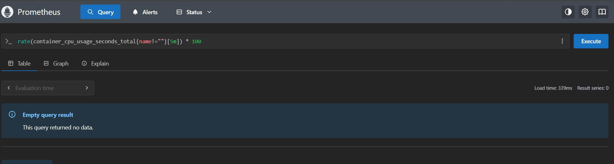
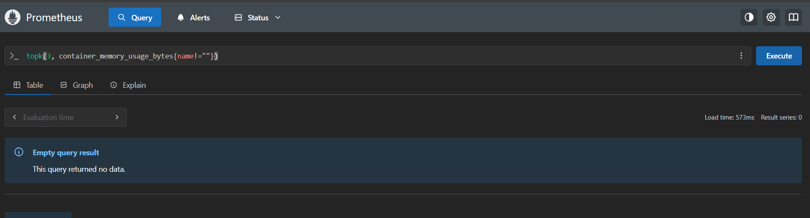


Compare the `prometheus.yml` from the reference repo with the one you built over days 73-76. Note the scrape jobs and intervals.
ans = both yaml file are same 

---

### Task 3: Validate the Logs Pipeline
Generate traffic so there are logs to see:

```bash
for i in $(seq 1 50); do
  curl -s http://localhost:8000 > /dev/null
  curl -s http://localhost:8000/api/ > /dev/null
done
```

Open Grafana (`http://localhost:3000`) and go to Explore:

1. Select Loki as the datasource
2. Run these LogQL queries:

```logql
# All container logs
{job="docker"}

# Only notes-app logs
{container_name="notes-app"}

# Errors across all containers
{job="docker"} |= "error"

# HTTP request logs from the app
{container_name="notes-app"} |= "GET"

# Rate of log lines per container
sum by (container_name) (rate({job="docker"}[5m]))
```
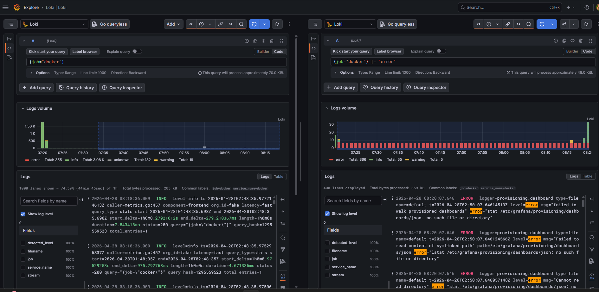
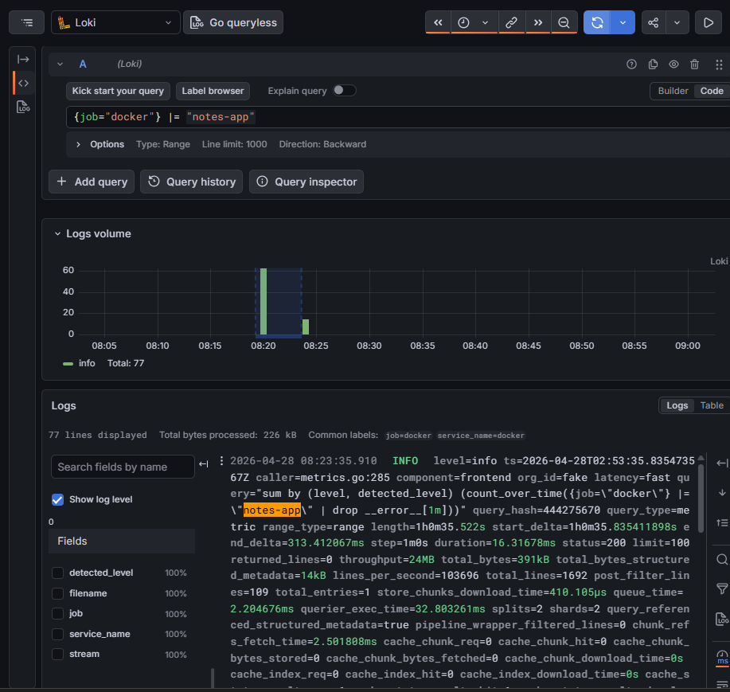
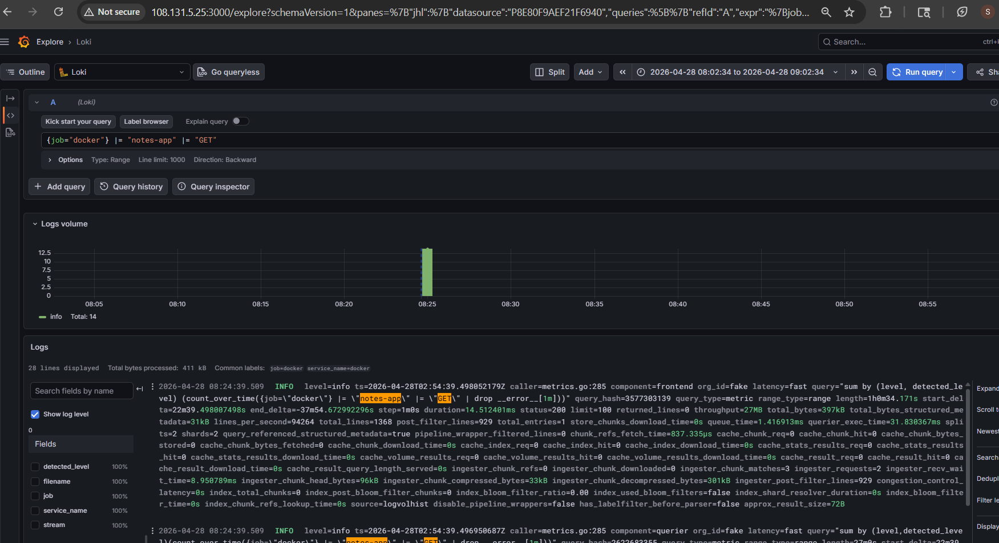
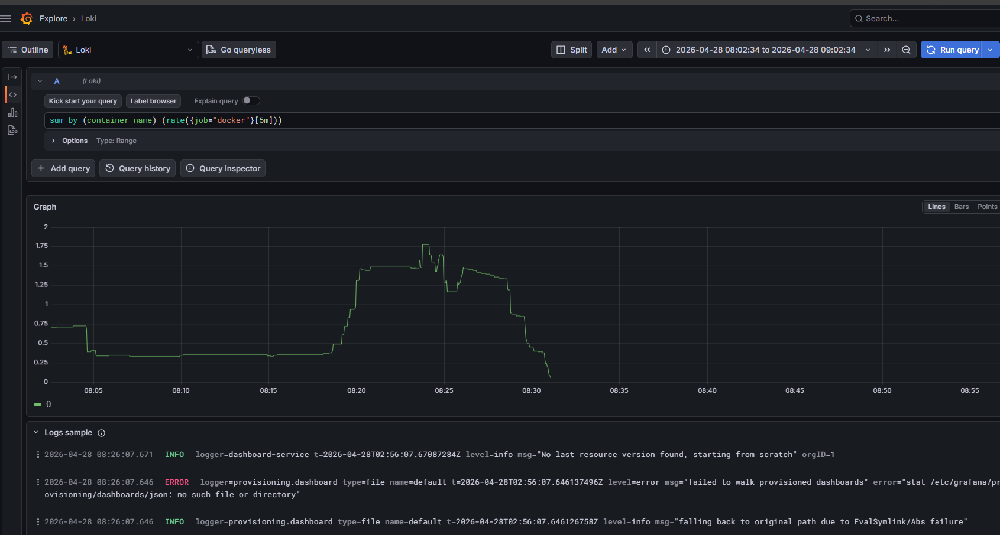

Check Promtail's targets to see which log files it is watching:
```bash
curl -s http://localhost:9080/targets | head -30
```

Compare `promtail/promtail-config.yml` from the reference repo with yours from Day 75.

---

### Task 4: Validate the Traces Pipeline
Send OTLP traces to the collector:

```bash
curl -X POST http://localhost:4318/v1/traces \
  -H "Content-Type: application/json" \
  -d '{
    "resourceSpans": [{
      "resource": {
        "attributes": [{
          "key": "service.name",
          "value": { "stringValue": "notes-app" }
        }]
      },
      "scopeSpans": [{
        "spans": [{
          "traceId": "aaaabbbbccccdddd1111222233334444",
          "spanId": "1111222233334444",
          "name": "GET /api/notes",
          "kind": 2,
          "startTimeUnixNano": "1700000000000000000",
          "endTimeUnixNano": "1700000000150000000",
          "attributes": [{
            "key": "http.method",
            "value": { "stringValue": "GET" }
          },
          {
            "key": "http.route",
            "value": { "stringValue": "/api/notes" }
          },
          {
            "key": "http.status_code",
            "value": { "intValue": "200" }
          }],https://github.com/ssarovar6/observability-for-devops.git
          "status": { "code": 1 }
        },
        {
          "traceId": "aaaabbbbccccdddd1111222233334444",
          "spanId": "5555666677778888",
          "parentSpanId": "1111222233334444",
          "name": "SELECT notes FROM database",
          "kind": 3,
          "startTimeUnixNano": "1700000000020000000",
          "endTimeUnixNano": "1700000000120000000",
          "attributes": [{
            "key": "db.system",
            "value": { "stringValue": "sqlite" }
          },
          {
            "key": "db.statement",
            "value": { "stringValue": "SELECT * FROM notes" }
          }]
        }]
      }]
    }]
  }'
```

This simulates a two-span trace: an HTTP request that calls a database query.

Check the debug output:
```bash
docker logs otel-collector 2>&1 | grep -A 20 "GET /api/notes"
```

You should see both spans with their attributes, the parent-child relationship, and timing data.

Compare `otel-collector/otel-collector-config.yml` from the reference repo with yours from Day 76.

---

### Task 5: Build a Unified "Production Overview" Dashboard
Create a single Grafana dashboard that gives a complete picture of your system.

Go to Dashboards > New Dashboard. Add these panels:

**Row 1 -- System Health (Node Exporter + Prometheus):**

| Panel | Type | Query |
|-------|------|-------|
| CPU Usage | Gauge | `100 - (avg(rate(node_cpu_seconds_total{mode="idle"}[5m])) * 100)` |
| Memory Usage | Gauge | `(1 - node_memory_MemAvailable_bytes / node_memory_MemTotal_bytes) * 100` |
| Disk Usage | Gauge | `(1 - node_filesystem_avail_bytes{mountpoint="/"} / node_filesystem_size_bytes{mountpoint="/"}) * 100` |
| Targets Up | Stat | `sum(up)` / `count(up)` |

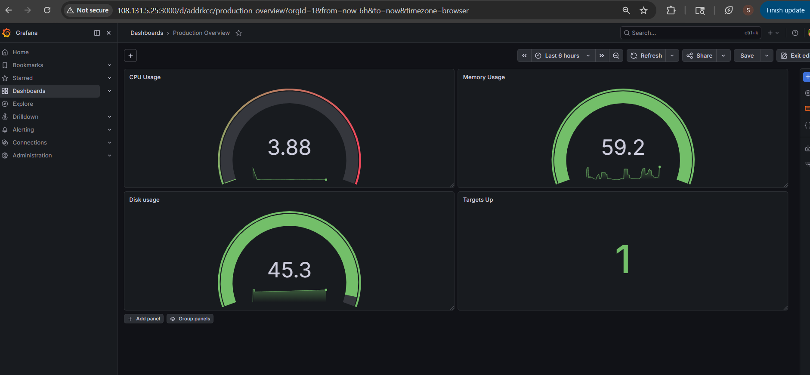


**Row 2 -- Container Metrics (cAdvisor):**

| Panel | Type | Query |
|-------|------|-------|
| Container CPU | Time series | `rate(container_cpu_usage_seconds_total{name!=""}[5m]) * 100` (legend: `{{name}}`) |
| Container Memory | Bar chart | `container_memory_usage_bytes{name!=""} / 1024 / 1024` (legend: `{{name}}`) |
| Container Count | Stat | `count(container_last_seen{name!=""})` |

NOTE For me - since Query for container CPU was not returning any data folllowing changes i took:-
added these values in docker-compose.yml file for cadvisor
privileged: true  # This gives the container extended Linux capabilities and broad access to host kernel features/devices.Without it, cAdvisor may run but expose limited metrics.
  devices:        # Kernel log access, OOM (Out Of Memory) event detection
    - /dev/kmsg
  volumes:
    - /:/rootfs:ro
    - /var/run:/var/run:ro    # mount full runtime dir
    - /run:/run:ro
    - /sys:/sys:ro
    - /var/lib/docker:/var/lib/docker:ro
    - /dev/disk:/dev/disk:ro   # For storage/filesystem stats

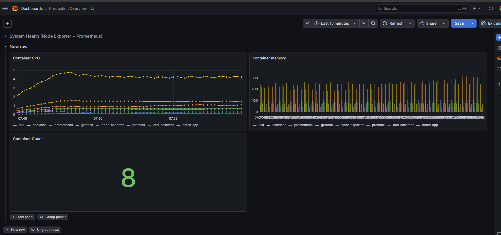

**Row 3 -- Application Logs (Loki):**

| Panel | Type | Query (Loki datasource) |
|-------|------|-------|
| App Logs | Logs | `{container_name=\"notes-app\"}` |  ||   {job="docker"} |= "notes-app"
| Error Rate | Time series | `sum(rate({job="docker"} \|= "error" [5m]))` |
| Log Volume | Time series | `sum by (container_name) (rate({job="docker"}[5m]))` |

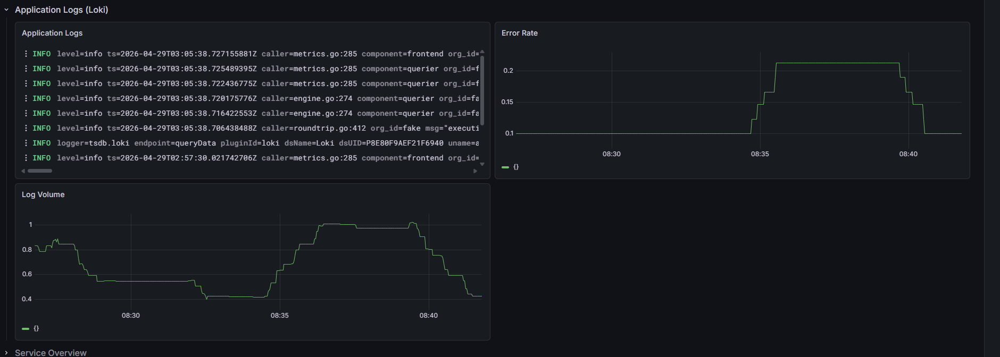

**Row 4 -- Service Overview:**

| Panel | Type | Query |
|-------|------|-------|
| Prometheus Scrape Duration | Time series | `prometheus_target_interval_length_seconds{quantile="0.99"}` |
| OTEL Metrics Received | Stat | `otelcol_receiver_accepted_metric_points` (if available) |

Save the dashboard as "Production Overview -- Observability Stack".

Set the dashboard time range to "Last 30 minutes" and enable auto-refresh (every 10s).

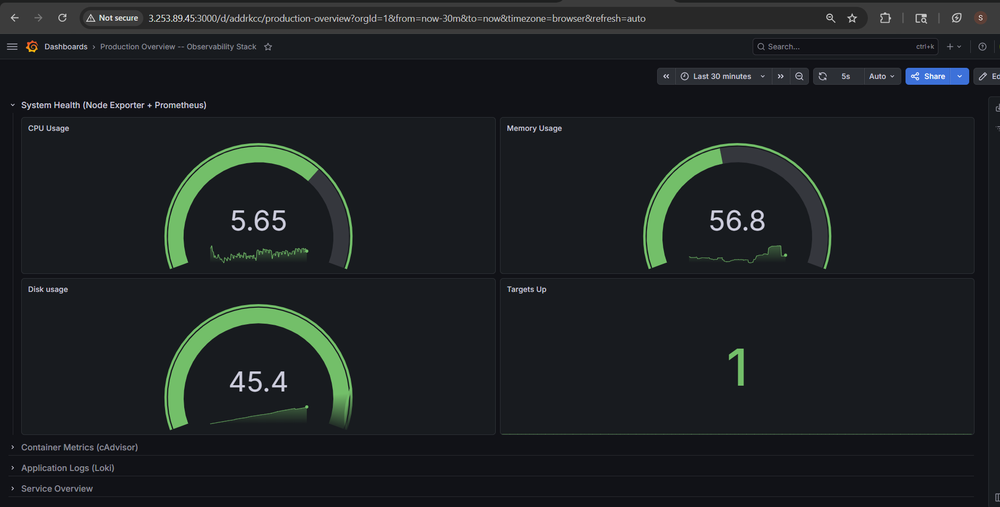
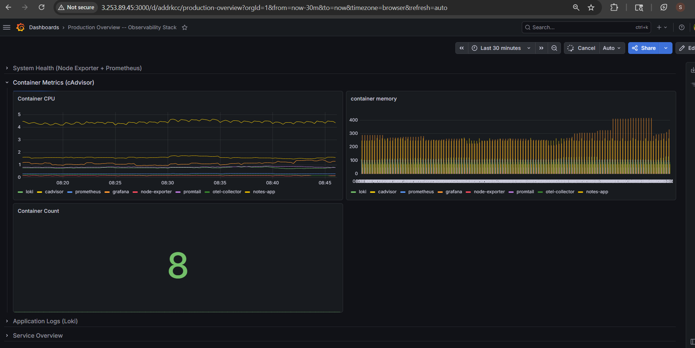
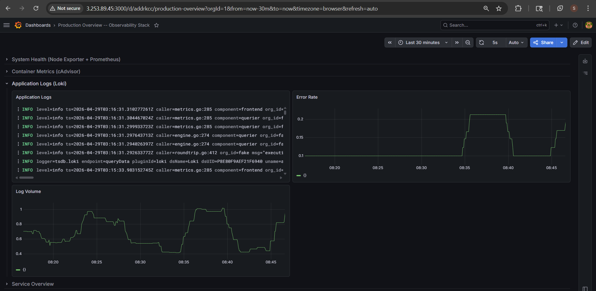
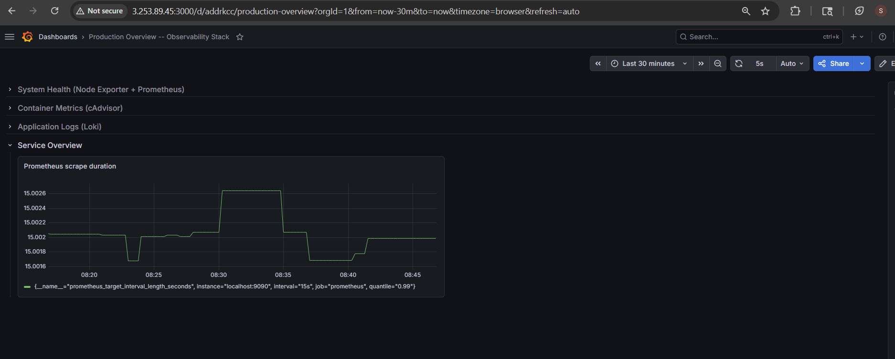

---

### Task 6: Compare Your Stack with the Reference and Document
Now compare what you built over days 73-76 with the reference repository.

| Component | Your Version | Reference Repo | Differences |
|-----------|-------------|----------------|-------------|
| `prometheus.yml` | Day 73-74 | Root directory | Compare scrape jobs |
| `loki-config.yml` | Day 75 | `loki/` directory | Compare storage config |
| `promtail-config.yml` | Day 75 | `promtail/` directory | Compare scrape configs |
| `otel-collector-config.yml` | Day 76 | `otel-collector/` directory | Compare pipelines |
| `datasources.yml` | Day 74 | `grafana/provisioning/` | Compare provisioned sources |
| `docker-compose.yml` | Days 73-76 | Root directory | Compare all 8 services |

**Reflect and document:**

1. Map each observability concept to the day you learned it:

| Day | What You Built |
|-----|---------------|
| 73 | Prometheus, PromQL, metrics fundamentals |
| 74 | Node Exporter, cAdvisor, Grafana dashboards |
| 75 | Loki, Promtail, LogQL, log-metric correlation |
| 76 | OTEL Collector, traces, alerting rules |
| 77 | Full stack integration, unified dashboard |

2. What would you add for production?
   - Alertmanager for routing alerts to Slack/PagerDuty
   - Grafana Tempo for trace storage (replacing debug exporter)
   - HTTPS/TLS for all endpoints
   - Authentication on Grafana and Prometheus
   - Log retention policies and storage limits
   - High availability (multiple Prometheus/Loki replicas)

3. How does this stack compare to managed solutions like Datadog, New Relic, or AWS CloudWatch?
ans = 
1. Datadog
Best For:

Teams wanting everything working quickly.

Strengths:
Excellent UX
Unified metrics/logs/traces
Great Kubernetes/cloud integrations
Powerful alerting
Easy onboarding
Weakness:

Costs often rise sharply with logs, custom metrics, hosts, containers, traces. Many engineers cite pricing as a common concern.

Verdict:

If budget is less important than speed and polish → Datadog wins.

2. New Relic
Best For:

Teams wanting enterprise observability with simpler pricing than Datadog.

Strengths:
Strong APM history
Good full-stack monitoring
Usage-based pricing model
Good free tier / starter path
Weakness:

UI complexity and ingest-based pricing can still become costly depending on volume.

Verdict:

Strong enterprise alternative if Datadog pricing is too high.

3. Amazon CloudWatch
Best For:

AWS-heavy environments.

Strengths:
Native with EC2, Lambda, ECS, EKS
IAM integrated
No extra agents needed in many cases
Good logs/events metrics for AWS services
Weakness:
UI/query experience often weaker than Grafana/Datadog
Cross-platform observability less elegant
Costs can surprise at scale (logs/custom metrics).
Verdict:

Great if 90% of workload is AWS.

Why Many Companies Choose Your Stack
Prometheus + Grafana + Loki + Tempo
Advantages:
No per-host/per-container vendor pricing
Open source and portable
Huge community adoption
Best if you want control
Great for Kubernetes

Tradeoff:
You become the platform owner:
upgrades
backups
scaling
HA
security
on-call for observability itself

**Clean up when done:**
```bash
docker compose down -v
```

The `-v` flag removes named volumes (Prometheus data, Grafana data, Loki data). Only use this if you are done exploring.

---

## Hints
- If a service fails to start, check logs: `docker compose logs <service-name>`
- The reference repo uses a shared `monitoring` network -- all services can communicate by container name
- `restart: unless-stopped` ensures containers come back after a Docker daemon restart
- Grafana dashboard JSON can be exported (Share > Export) and saved as code for dashboard-as-code workflows
- If Grafana shows "No data" for Loki panels, make sure you generated traffic first (`curl` the notes app) and check the time range
- The notes-app is a Django REST API -- browse `http://localhost:8000/api/` for the API endpoints
- Reference repo: https://github.com/LondheShubham153/observability-for-devops

---