# Day 64 -- Terraform State Management and Remote Backends

The state file is the single most important thing in Terraform. It is the source of truth -- the map between your `.tf` files and what actually exists in the cloud. Lose it and Terraform forgets everything. Corrupt it and your next apply could destroy production.

### Task 1: Inspect Your Current State
Use your Day 63 config (or create a small config with a VPC and EC2 instance). Apply it and then explore the state:

```bash
terraform show                                    # Full state in human-readable format
terraform state list                              # All resources tracked by Terraform
terraform state show aws_instance.<name>          # Every attribute of the instance
terraform state show aws_vpc.<name>               # Every attribute of the VPC
```

Answer:
1. How many resources does Terraform track? ands= all resources mentioned in .tf file for resources
2. What attributes does the state store for an EC2 instance? (hint: way more than what you defined)
3. Open `terraform.tfstate` in an editor -- find the `serial` number. What does it represent?

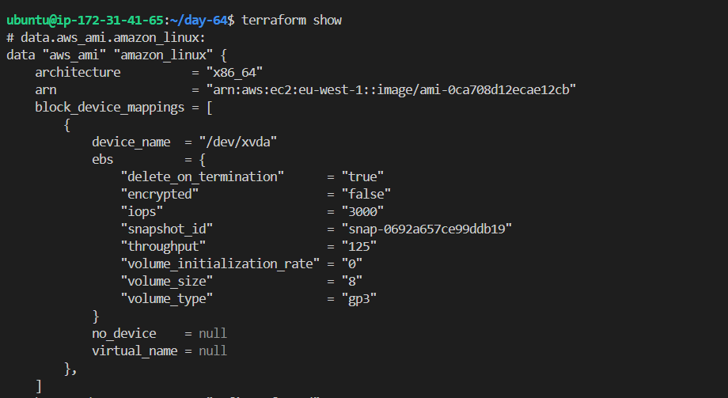
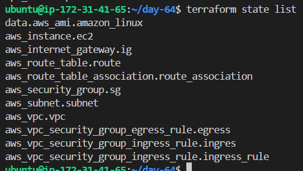
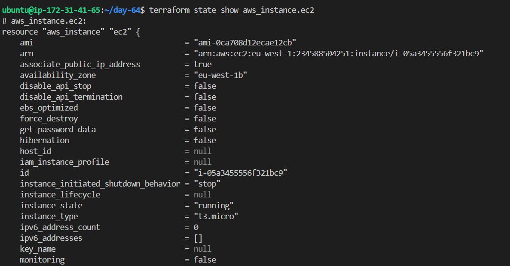
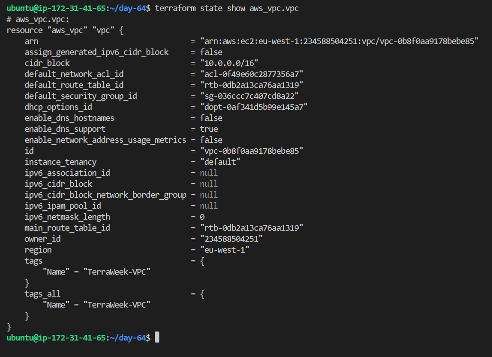

---

### Task 2: Set Up S3 Remote Backend
Storing state locally is dangerous -- one deleted file and you lose everything. Time to move it to S3.

1. First, create the backend infrastructure (do this manually or in a separate Terraform config):
```bash
# Create S3 bucket for state storage
aws s3api create-bucket \
  --bucket terraweek-state-sudhasarovar \
  --region eu-west-1 \
  --create-bucket-configuration LocationConstraint=eu-west-1

  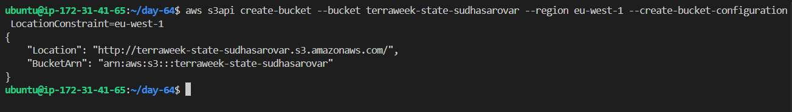
  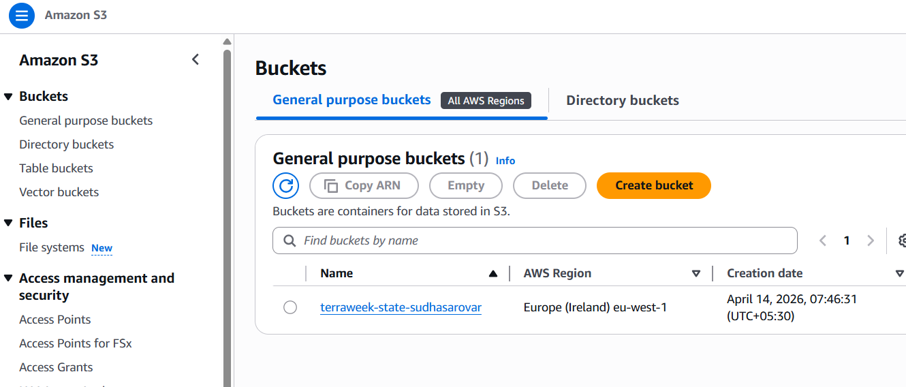

# Enable versioning (so you can recover previous state)
aws s3api put-bucket-versioning \
  --bucket terraweek-state-sudhasarovar \
  --versioning-configuration Status=Enabled

  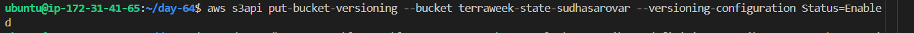
  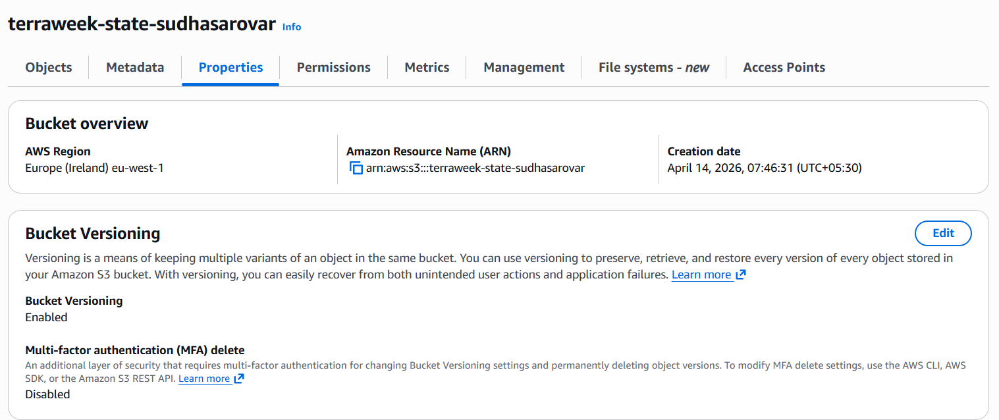

# Create DynamoDB table for state locking
aws dynamodb create-table \
  --table-name terraweek-state-lock \
  --attribute-definitions AttributeName=LockID,AttributeType=S \
  --key-schema AttributeName=LockID,KeyType=HASH \
  --billing-mode PAY_PER_REQUEST \
  --region eu-west-1
  
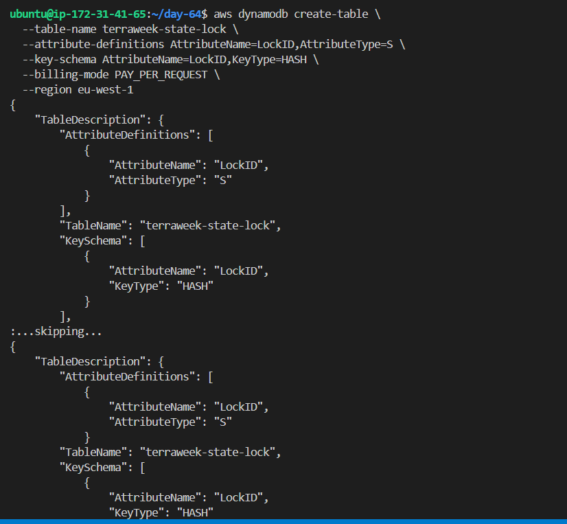
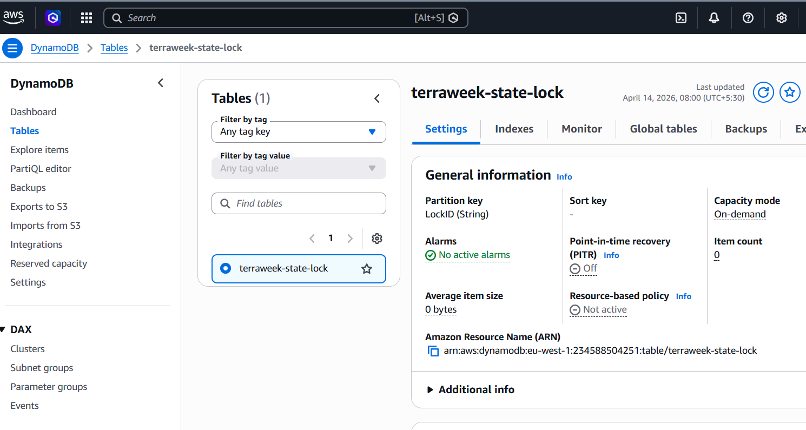


```

2. Add the backend block to your Terraform config:
```hcl
terraform {
  backend "s3" {
    bucket         = "terraweek-state-<yourname>"
    key            = "dev/terraform.tfstate"
    region         = "ap-south-1"
    dynamodb_table = "terraweek-state-lock"
    encrypt        = true
  }
}
```

3. Run:
```bash
terraform init
```
Terraform will ask: "Do you want to copy existing state to the new backend?" -- say yes.

4. Verify:
   - Check the S3 bucket -- you should see `dev/terraform.tfstate`
 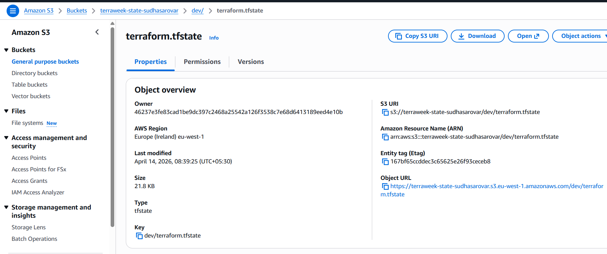

   - Your local `terraform.tfstate` should now be empty or gone = i checked file is empty
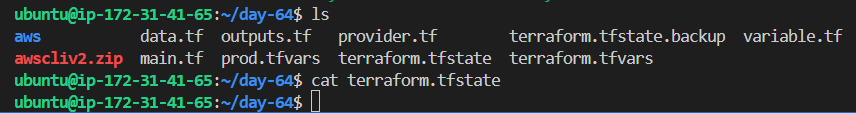

   - Run `terraform plan` -- it should show no changes (state migrated correctly)

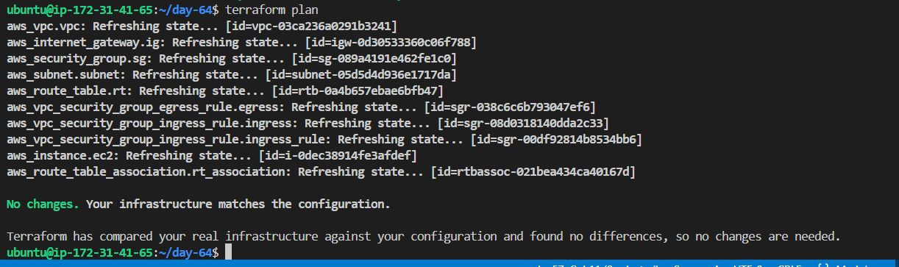

---

### Task 3: Test State Locking
State locking prevents two people from running `terraform apply` at the same time and corrupting the state.

1. Open **two terminals** in the same project directory
2. In Terminal 1, run:
```bash
terraform apply
```
3. While Terminal 1 is waiting for confirmation, in Terminal 2 run:
```bash
terraform plan
```
4. Terminal 2 should show a **lock error** with a Lock ID

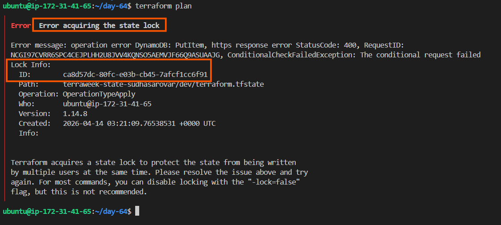

**Document:** What is the error message? Why is locking critical for team environments? ans = Error acquiring the state lock. Locking is critical to protect the state from being written by multiple users at the same time.

5. After the test, if you get stuck with a stale lock:
```bash
terraform force-unlock <LOCK_ID>

## this command is not working had to delete manually from AWS Console>dynamodb

```

---

### Task 4: Import an Existing Resource
Not everything starts with Terraform. Sometimes resources already exist in AWS and you need to bring them under Terraform management.

1. Manually create an S3 bucket in the AWS console -- name it `terraweek-import-test-<yourname>`
2. Write a `resource "aws_s3_bucket"` block in your config for this bucket (just the bucket name, nothing else)
3. Import it:
```bash
terraform import aws_s3_bucket.imported terraweek-import-test-<yourname>

```
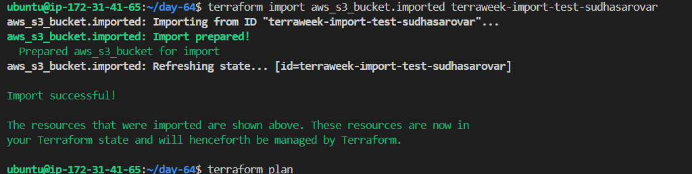

4. Run `terraform plan`:
   - If you see "No changes" -- the import was perfect
   - If you see changes -- your config does not match reality. Update your config to match, then plan again until you get "No changes"

   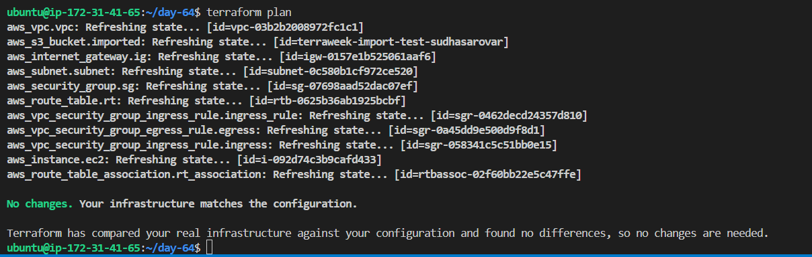

5. Run `terraform state list` -- the imported bucket should now appear alongside your other resources

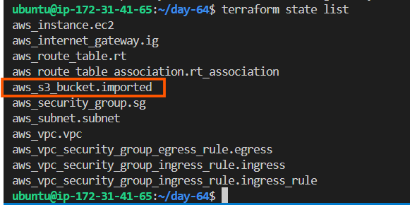

**Document:** What is the difference between `terraform import` and creating a resource from scratch? ans = From Scratch: Terraform starts with a configuration file (.tf), then creates the state file (.tfstate) upon deployment to track the new resource.
terraform import: It primarily updates the state file by mapping an existing remote resource to an ID you provide. Traditional terraform import does not generate configuration code; you must manually write the matching resource block yourself.

---

### Task 5: State Surgery -- mv and rm
Sometimes you need to rename a resource or remove it from state without destroying it in AWS.

1. **Rename a resource in state:**
```bash
terraform state list                              # Note the current resource names
terraform state mv aws_s3_bucket.imported aws_s3_bucket.logs_bucket
```
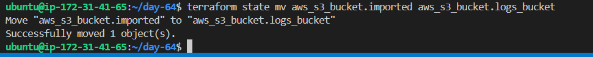

Update your `.tf` file to match the new name. Run `terraform plan` -- it should show no changes.

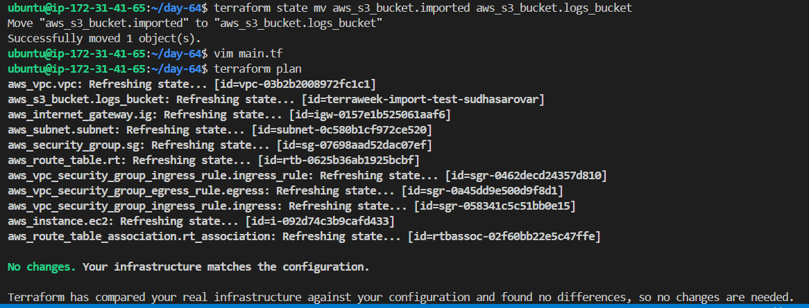

2. **Remove a resource from state (without destroying it):**
```bash
terraform state rm aws_s3_bucket.logs_bucket
```
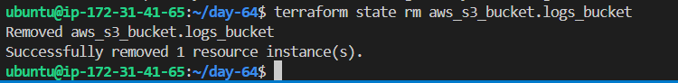

Run `terraform plan` -- Terraform no longer knows about the bucket, but it still exists in AWS.


3. **Re-import it** to bring it back:
```bash
terraform import aws_s3_bucket.logs_bucket terraweek-import-test-<yourname>
```

**Document:** When would you use `state mv` in a real project? When would you use `state rm`? ans = Use terraform state mv when you want to rename or relocate a resource while keeping it under Terraform's management and Use terraform state rm when you want Terraform to "forget" a resource entirely without deleting it from your cloud provider

---

### Task 6: Simulate and Fix State Drift
State drift happens when someone changes infrastructure outside of Terraform -- through the AWS console, CLI, or another tool.

1. Apply your full config so everything is in sync
2. Go to the **AWS console** and manually:
   - Change the Name tag of your EC2 instance to `"ManuallyChanged"`
   - Change the instance type if it's stopped (or add a new tag)
3. Run:
```bash
terraform plan
```
You should see a **diff** -- Terraform detects that reality no longer matches the desired state.

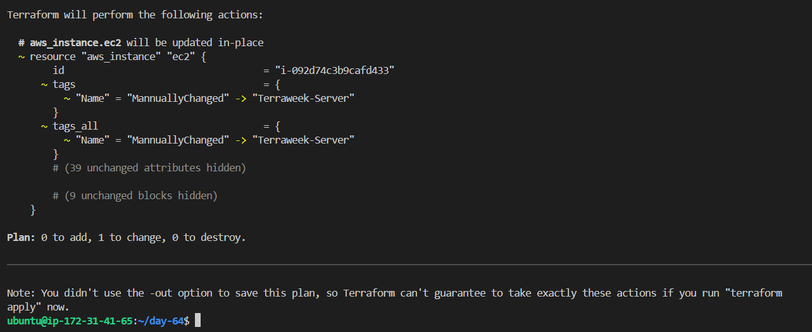

4. You have two choices:
   - **Option A:** Run `terraform apply` to force reality back to match your config (reconcile)
   - **Option B:** Update your `.tf` files to match the manual change (accept the drift)

5. Choose Option A -- apply and verify the tags are restored.

6. Run `terraform plan` again -- it should show "No changes." Drift resolved.

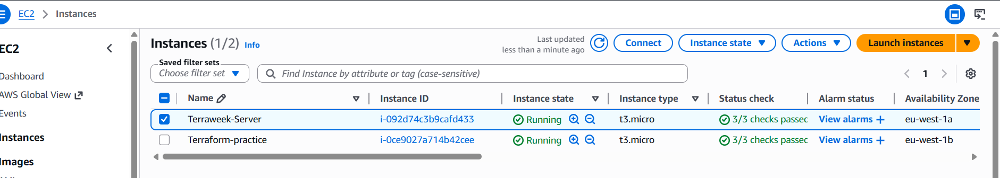
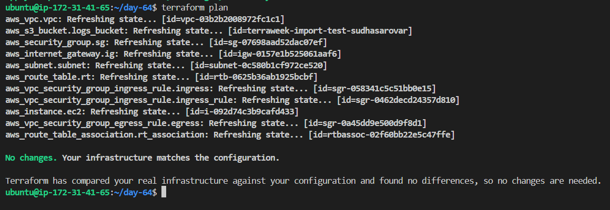

**Document:** How do teams prevent state drift in production? (hint: restrict console access, use CI/CD for all changes)

---

## Hints
- S3 bucket names must be globally unique
- DynamoDB table must have a `LockID` string key -- this is what Terraform uses for locking
- `terraform init -migrate-state` explicitly triggers state migration
- `terraform refresh` (or `terraform apply -refresh-only`) updates state to match real infrastructure without making changes
- State locking only works with backends that support it (S3+DynamoDB, Consul, Terraform Cloud)
- `terraform force-unlock` should only be used when you are sure no other operation is running
- Always version your S3 bucket so you can recover a previous state file if something goes wrong

---